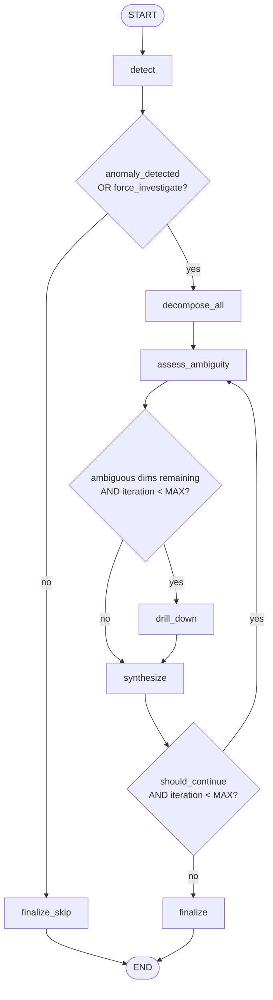
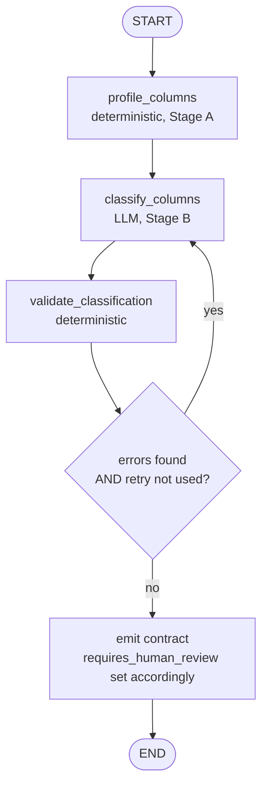

# MetricPulse Agentic Layer — Scoping Document

**Status:** Scoping complete (Sections 1–10) as of 2026-07-28. Implementation not yet started — see Section 10 for the rollout plan and milestone order.
**Framework:** LangGraph (decided — see [Decision Log](#decision-log)).
**Related docs:** [`Kousik_Market_Gap_Analysis_July2026.md`](Kousik_Market_Gap_Analysis_July2026.md) (why this exists), [`resume_project_doc.md`](resume_project_doc.md) (current project state), [`../CLAUDE.md`](../CLAUDE.md) (codebase conventions).

---

## 0. Purpose of This Document

This document is the guardrail for a specific, bounded addition to MetricPulse: an agentic layer built with LangGraph. It exists because "add an agent" is exactly the kind of feature that can quietly balloon into an unbounded rewrite. Every section below is written to answer two questions before any code gets written: *what does this section actually build*, and *what does it explicitly refuse to build*. When implementation starts, this document — not conversation memory — is the source of truth for scope.

---

## 1. Context & Motivation

Two separate problems motivated this initiative, and they turned out to share a root cause.

**Problem A — Resume/market gap.** `Kousik_Market_Gap_Analysis_July2026.md` (evaluated against 30+ real JDs, July 2026) names multi-agent frameworks — LangGraph specifically — as the single most closable hard gap (Section 1.6, Section 7 Priority 1). MetricPulse currently has zero GenAI/agentic surface area: it is a rules-based statistics + templating pipeline (z-score, contribution %, Jinja2), which is a strong data-engineering story but does not evidence the skill category the target role (Applied AI / GenAI Engineer) screens hardest for.

**Problem B — Product limitation.** MetricPulse only works on the one dataset it was built against (Olist Brazilian e-commerce, 451K rows). Point it at a different CSV export or a different company's Redshift schema and it breaks immediately — not because the statistics are wrong, but because the pipeline doesn't know which column is a date, which is a revenue-like metric, or which columns are meaningful segments to decompose by. That mapping was done once, by hand, by a human reading the Olist column names.

**The shared root cause:** both problems point at the same seam in the codebase — see Section 1.2 below. Closing Problem B (schema generalization) is naturally an agent's job, and building that agent in LangGraph closes Problem A at the same time. This document treats them as one initiative with two phases rather than two separate features.

---

## 2. Goals (Definition of Success)

1. **G1 — Demonstrable LangGraph competency.** A real, running LangGraph application in this repo with multiple nodes, conditional edges, tool-calling, and persisted state — not a single-prompt wrapper relabeled as an "agent."
2. **G2 — MetricPulse stops being single-dataset.** A user can point the pipeline at a *different* tabular dataset (different columns, different domain) and get a working detect → decompose → narrate cycle without a human hand-writing new dbt models or a new `DIMENSION_TABLES` dict first.
3. **G3 — No regression to the existing pipeline.** The current dbt/detection/decomposition/narrative/alerting pipeline, its 15 tests, and the Django API/dashboard continue to work exactly as they do today, unmodified in their tested behavior. The agentic layer is additive.
4. **G4 — Grounded, not decorative.** Any LLM-generated output (narrative text, schema mappings, generated SQL) must be traceable to real numbers/columns it was given as tool output — never free-form generation presented as fact. This is what separates "agent" from "chatbot bolted onto a dashboard."
5. **G5 — Resume-defensible.** Every claim this feature lets the user make in an interview must be literally true of the code. No feature gets built primarily to sound good on a bullet point if it doesn't also satisfy G1–G4.

---

## 3. Global Non-Goals / Out of Scope

These apply to the *entire* initiative (both phases). Section-specific out-of-scope items will be added under each section as they're designed, but nothing below is ever in scope unless this document is explicitly revised.

- **Not a general-purpose "understand any dataset in any business domain" system.** The onboarding agent (Phase 2) is bounded to tabular data with a date-like column, at least one numeric metric-like column, and at least one categorical dimension-like column — i.e., datasets shaped like a business-metrics fact table. It is not trying to solve arbitrary schema understanding (e.g., unstructured text, images, graph data, or datasets with no time dimension at all).
- **Not autonomous end-to-end.** No phase of this initiative runs unsupervised against a new, unvalidated dataset and publishes an alert without a human confirmation step at the schema-mapping stage (detailed in the eventual Section 7). Full autonomy here is a credibility risk, not just an engineering one — an agent that silently mis-classifies a column and emails a wrong "root cause" to a subscriber is a worse portfolio story than no agent at all.
- **Not a replacement for dbt.** The existing dbt project stays as the transformation layer for the current dataset. Phase 2 either generates *new* dbt models for a new dataset (script-assisted, human-reviewed) or runs an equivalent lightweight pandas/SQL path for datasets that don't warrant a full dbt project — it does not modify dbt's role for the existing pipeline.
- **Not a rewrite of detection/decomposition/narrative math.** `calculate_zscore`, `calculate_contribution`, and `generate_narrative`'s Jinja2 rendering are already dataset-agnostic pure functions (confirmed in Section 1.2) — they get reused as-is via tool wrappers, not reimplemented.
- **Not fine-tuning or training a model.** This initiative is entirely prompting + tool-calling + orchestration (LangGraph). Model training is a separate, already-identified gap (Priority 3 in the market analysis) with a different portfolio story — conflating the two would blow the scope of both.
- **Not a UI redesign.** Any surfacing of agent output in the Django dashboard is additive to existing panels, not a rebuild of `templates/`.
- **Not multi-cloud or infra work.** No Kubernetes, no Terraform, no new cloud provider. Runs on the same AWS footprint (Redshift, S3) the project already uses.
- **Not CrewAI, AutoGen, or a framework bake-off.** Decided: LangGraph only, for both phases (see Decision Log). Revisit only if this document is explicitly reopened.

---

## 4. Document Structure

This document grows section by section, in this order, as each is designed and agreed on:

| # | Section | Status |
|---|---------|--------|
| 1 | Why an Agent, Not a Config File | ✅ Below |
| 2 | Phase 1: LangGraph graph design — state schema, nodes/edges, tool definitions | ✅ Below |
| 3 | Phase 1: Grounding / anti-hallucination design | ✅ Below |
| 4 | Phase 1: Integration points (`orchestration/`, Django API, dashboard) | ✅ Below |
| 5 | Phase 2: Schema profiling + column-role classification | ✅ Below |
| 6 | Phase 2: Codegen strategy (dbt SQL vs. bypass-dbt path) | ✅ Below |
| 7 | Phase 2: Human-in-the-loop and validation design | ✅ Below |
| 8 | Testing & evaluation strategy | ✅ Below |
| 9 | Resume / portfolio framing | ✅ Below |
| 10 | Rollout plan and effort estimate | ✅ Below |

## Decision Log

| Date | Decision | Reasoning |
|------|----------|-----------|
| 2026-07-27 | Framework = LangGraph (not CrewAI) for both phases | CrewAI was evaluated and is a legitimate fit for the same market gap (Section 1.6 of the gap analysis names both), but the user chose to stay with the original LangGraph plan. LangGraph also has marginally stronger direct-frequency evidence in the JD dataset (named individually 5+ times vs. CrewAI being bundled in the category). |
| 2026-07-27 | Phase 1 uses deterministic/rule-based routing for data-gathering and ambiguity detection; the LLM is reserved for evidence synthesis and a structured continue/stop decision — not free-form ReAct-style tool selection | Keeps grounding auditable (Goal G4) and avoids paying for LLM judgment where a numeric threshold already does the job cleanly (Goal G5) |
| 2026-07-27 | Phase 1 adds one genuinely new backend capability: querying at `detail_col` grain (e.g. state within region) | `DIMENSION_TABLES` in `decomposition/decomposer.py` already defines `detail_col` per dimension, but no function in the current codebase ever queries it — confirmed by reading the full file. Without this, the agent would have nothing to investigate that the static pipeline doesn't already report. |
| 2026-07-28 | Ambiguity is typed (`close_contributors` vs. `offsetting_segments`), not a flat boolean; only `close_contributors` triggers `drill_down` | A leaf-level query cannot resolve two segments that are genuinely moving in opposite directions — more data doesn't fix that kind of ambiguity, honest narration does. Drilling in that case would waste a query and imply false precision. |
| 2026-07-28 | LLM output is never rendered directly as user-facing text. It's a structured citation object, validated against real state data, then rendered through a deterministic Jinja2 template that injects the actual numbers | This is the core grounding enforcement mechanism (Goal G4) — prompting the model to "not hallucinate" is necessary but not sufficient; the numbers a reader sees must come from code, not from the model's token generation, even when the model is right. |
| 2026-07-28 | New agent code lives in a new `investigation/` folder; the one new Redshift-query function (`fetch_detail_metrics`) lives in `decomposition/decomposer.py`, not in `investigation/` | Keeps domain ownership consistent with existing conventions — `decomposition/` already owns every Redshift decomposition query; `investigation/` owns only graph orchestration, state, prompts, and LLM-specific logic. |
| 2026-07-28 | `orchestration/run_pipeline.py` gets one new optional keyword (`run_investigation: bool = False`) rather than a parallel pipeline function; graph nodes are written to be idempotent so pre-seeded state skips re-fetching | Preserves zero behavior change for every existing caller/test (Goal G3) while giving orchestration a single supported integration point, and avoids re-querying data the pipeline already fetched — the same double-query anti-pattern already flagged as a known gap between `NarrativeView`/`DecompositionView`. |
| 2026-07-28 | `/api/investigate/` is synchronous — no background job queue | No task-queue infrastructure exists anywhere in this project today; introducing one would be new infra scope, which the Global Non-Goals already rule out. |
| 2026-07-28 | Phase 2 profiles a single flat/denormalized input file per run — no multi-table join or foreign-key inference | Reaffirms the Section 1.7 non-goal, now made operationally binding: profiling assumes the user hands over one table-shaped dataset (pre-joined/flattened if their real source is normalized, the way Olist's 7 raw tables were joined by hand into `fact_daily_metrics`), not a schema of related tables. |
| 2026-07-28 | Column profiling (Stage A) is fully deterministic and local (pandas, no LLM call); only role classification (Stage B) calls an LLM, and only over column-level statistics/samples — never raw rows | Bounds LLM cost independent of dataset row count (a 451K-row file and a 10M-row file produce the same size prompt), and continues the Section 2.1 philosophy of using an LLM only where a rule can't do the job. |
| 2026-07-28 | Classification output is validated against Stage A's real computed statistics before being trusted, with one bounded retry, then fail-to-human-review — the same structured-output + deterministic-validation + bounded-retry pattern as Sections 3.3–3.6 | Reusing a proven pattern rather than inventing a new one for a structurally similar problem (LLM proposes something checkable against ground truth; code either confirms or rejects it) — internal consistency across the whole initiative, not a new philosophy per section. |
| 2026-07-28 | Codegen targets a local DuckDB file + a generated dimension-config dict as the v1 default, not real dbt models against Redshift | Zero AWS cost or credentials needed to demonstrate generalization live — a strong, fast, in-person "watch it onboard a new dataset" demo. Real dbt/Redshift codegen is named as a v2/stretch capability (6.6), not built, so the document doesn't overclaim. |
| 2026-07-28 | `decomposer.py` and `anomaly_detector.py` gain optional `connection_factory` / `dimension_config` / `table_name` parameters (defaulting to today's exact Redshift/Olist behavior) rather than being duplicated for onboarded datasets | Reuses the same tested, parameterized SQL-building logic against a second backend with a minimal additive signature change — the same backward-compatible-optional-parameter pattern already used for `run_pipeline(run_investigation=False)` in Section 4.2. Existing tests for both modules stay green since the defaults reproduce current behavior exactly. |
| 2026-07-28 | Onboarded datasets get no `dim_*` business-taxonomy remapping layer in v1 — `segment_col` and `detail_col` are the same column, so `drill_down` degrades to a no-op for onboarded data | The Olist `dim_geography`/`dim_product` tables encode a human judgment call (27 states → 5 regions, 73 categories → 7 groups) with no generic automated equivalent. Section 5's `dimension_columns` are chosen specifically because they're already bounded-cardinality, so this layer isn't needed to make the pipeline work — skipping it is an honest, bounded simplification, not an oversight. |
| 2026-07-28 | Human confirmation of a new dataset's classification is a single synchronous CLI prompt (v1), not a dashboard UI or async review queue | Matches this project's existing CLI-first convention for one-time/on-refresh operations (`python -m ingestion.upload_to_s3`, etc.); avoids new infra the Global Non-Goals already exclude (Section 4.8); keeps the "watch it onboard live" demo fast — a dashboard review wizard is named as an optional v2 extension, not built. |
| 2026-07-28 | Review is gated by three explicit triggers (first-time dataset, schema fingerprint changed since last confirmation, unresolved validation errors) — not required on every onboarding run | Resolves the tension between "no full autonomy" (Global Non-Goals) and a fast, repeatable demo: a stable, previously-confirmed dataset's config is reused without re-prompting, while anything new or changed always gets a human look. |
| 2026-07-28 | A human's explicit override of a validation warning is allowed and not blocked by code, even though the same warning is a hard gate when it's the LLM's own unconfirmed output | Distinguishes automated grounding (must justify itself against computed statistics — Section 5.4's hard gate) from human judgment (final authority, advisory only) — a human reviewing their own dataset can know things the profiler structurally can't. |
| 2026-07-28 | The LLM eval suite reuses the same deterministic validation functions built for production grounding (`validate_citation`, `validate_classification`, `validate_generated_tables`) as its graders, instead of a separate LLM-as-judge pipeline | Grounding was already designed as checkable validation against real computed facts (Sections 3.5, 5.4, 6.5) — the graders already exist as a byproduct of that design. Avoids the extra cost and reliability problems of LLM-as-judge for the structural-correctness dimension. |
| 2026-07-28 | Golden eval cases reuse the exact worked examples already built in Sections 3.8 and 5.6, rather than a separately authored eval dataset | Those examples were already constructed to be self-consistent and to exercise the specific rules worth checking (the offsetting-segment uncertainty requirement, non-Olist classification generality) — reusing them keeps the document internally consistent instead of authoring parallel fixtures that could drift from the design they're meant to test. |
| 2026-07-28 | The eval suite is a separate, manually-triggered command, not part of the CI `pytest` run | Real LLM API cost per run, unlike the existing free/fast deterministic unit tests — matches the project's established restraint about not adding new required cost or infrastructure to CI (Section 4.8). |
| 2026-07-28 | Resume claims in Section 9 are tagged as unlocked-by-milestone, not asserted as already true | This document is a pre-implementation spec — Goal G5's "resume-defensible" bar means a claim isn't valid until the code it describes actually exists. Applying that same discipline to the resume-writing process itself, not only to the system's own output. |
| 2026-07-28 | The SQL-depth claim from this initiative is scoped precisely to dynamic reconciliation-query generation and Redshift/DuckDB dialect-portable reuse (Sections 6.2, 6.5) — not to a window-function addition | A dbt window-function addition was floated earlier in this project's broader conversation, before scoping began, but was never incorporated into Sections 1–8. Claiming it here would describe work this initiative didn't actually specify. |
| 2026-07-28 | Phase 1 (Sections 2–4) is built and shipped before Phase 2 (Sections 5–7) begins, despite no strict engineering dependency between them | Phase 2's strongest payoff — Section 6.2's convergence, where the investigation agent works unmodified against a newly-onboarded dataset — only becomes real and demoable once Phase 1 already exists. Sequencing preserves the stronger story rather than building both halves in parallel. |
| 2026-07-28 | Milestone M1 (first real LLM integration, Section 3) is the designated calibration checkpoint for the rest of this plan's effort estimates | It's the highest-uncertainty milestone — first time wiring structured output, deterministic validation, and retry logic against a live LLM provider. M4 reuses the exact same proven pattern (Section 5.2's callback to Section 3.3), so M1's actual velocity is the best real signal for whether the rest of the estimate holds. |

---

# Section 1: Why an Agent, Not a Config File

## 1.1 Restating the problem precisely

"MetricPulse only works on one dataset" is imprecise. The statistics layer doesn't care what dataset it's given. The precise problem is: **three specific coupling points hardcode the Olist schema into the pipeline, and everything downstream of them inherits that rigidity.** Section 1.2 identifies exactly where, with line-level evidence from the current codebase — this matters because the fix should target those three points, not "the pipeline" in the abstract.

## 1.2 Anatomy of the current hardcoding

**Coupling point 1 — the dbt models themselves.** `dbt_project/models/staging/*.sql` and `models/marts/*.sql` are hand-written SQL referencing exact Olist column names (`order_purchase_timestamp`, `customer_state`, `product_category_name`, etc.). This is the deepest, most dataset-specific layer.

**Coupling point 2 — the "contract" tables.** The staging/marts layer produces a fixed output shape the rest of the pipeline depends on: `staging.fact_daily_metrics` (with a `metric_date` column and metric columns like `total_revenue`), and three dimension tables — `staging.metric_by_geography`, `staging.metric_by_product`, `staging.metric_by_payment` — each with a fixed `segment_col`/`detail_col` pair.

**Coupling point 3 — `decomposition/decomposer.py`'s `DIMENSION_TABLES` dict** (verified directly in the current source, lines 23–39):

```python
DIMENSION_TABLES = {
    'geography': {'table': 'staging.metric_by_geography', 'segment_col': 'region', 'detail_col': 'state_code'},
    'product':   {'table': 'staging.metric_by_product',   'segment_col': 'product_category_group', 'detail_col': 'product_category'},
    'payment':   {'table': 'staging.metric_by_payment',   'segment_col': 'payment_type_display',    'detail_col': 'payment_type'}
}
```

This is a Python-level hardcoding of exactly three dimensions, exactly these table names, exactly these column names. Point this at a different dataset and `fetch_dimension_metrics()` throws immediately — the tables it queries don't exist. Similarly, `get_comparison_dates()` hardcodes `staging.fact_daily_metrics` and the `metric_date` column name directly into its SQL.

**What is *not* hardcoded — this is the important counterpart finding.** Reading `calculate_contribution()` (decomposer.py lines 112–144), `detect_anomalies()`/`calculate_zscore()` (per `docs/detection_layer.md`, confirmed generic — operates on any numeric `metric_column` parameter), and `generate_narrative()` (narrative/generator.py lines 67–182) shows all three are **already dataset-agnostic pure functions**:
- `calculate_contribution(df)` only requires a DataFrame with `current_value`/`previous_value` columns — it has no idea what a "segment" represents semantically.
- `detect_anomalies(df, metric_column=...)` works on any numeric column, parameterized by name.
- `generate_narrative()`'s Jinja2 templates iterate `` — they render whatever dimension names they're given; nothing in the template text is hardcoded to "Geography/Product/Payment" (confirmed: `narrative/generator.py` lines 44–46, 60–61).

**Conclusion:** the entire statistical and narrative engine is already generic. The only things standing between MetricPulse and "any dataset" are (a) the dbt SQL and (b) one dict that maps semantic roles (date / metric / dimension) to physical table+column names. That is a much smaller, much more tractable problem than "generalize the whole pipeline," and it reframes Phase 2 correctly: **build the thing that produces coupling points 1–3 for a new dataset, don't rebuild anything downstream of them.**

## 1.3 Why a static config file alone doesn't solve this

The natural first instinct is: replace `DIMENSION_TABLES` with a YAML/JSON config file, and let a human write a new one per dataset. This is a real improvement (it decouples config from Python code) but it does not solve Problem B, because **the hard part was never the file format — it's the judgment call of which columns qualify as a date, a metric, or a dimension.** A config file still requires a human to open the new dataset, read column names like `pymnt_dt` vs. `cust_region_cd` vs. `qty_shipped`, and decide what role each plays. That's exactly the manual step that currently happens once, by hand, for Olist. Swapping Python hardcoding for YAML hardcoding moves the problem, it doesn't remove it — someone still has to be the "dataset onboarding engineer" for every new dataset.

## 1.4 Why an LLM/agent is well suited to this specific judgment call

Column-role classification — "does `pymnt_dt` look like a date column? does `cust_region_cd` look like a good decomposition dimension (bounded cardinality, categorical) versus a useless one (e.g., a free-text `notes` column, or a near-unique ID column)?" — is a language-and-pattern-matching task over structured metadata (column name, dtype, cardinality, null rate, sample values). This is precisely the kind of fuzzy-but-checkable inference LLMs are strong at, and precisely the kind of task that's tedious and repetitive for a human to redo per dataset. Three properties make it a *good* fit rather than an LLM-shaped hammer looking for a nail:

- **It's bounded.** The output is a structured classification (which column → which role), not open-ended prose or arbitrary code — see the contract in 1.6.
- **It's checkable.** Column statistics (cardinality, dtype, sample values) can validate or contradict the LLM's classification programmatically before anything runs against real data — e.g., a proposed "dimension" column with 50,000 distinct values is almost certainly wrong and can be rejected by a rule, not just by trusting the model.
- **It's inherently multi-step, not single-shot.** Profiling → hypothesis → validation → (possibly) re-examination when a hypothesis fails validation → human confirmation is a small state machine, not one prompt. That maps directly onto LangGraph rather than a bare LLM API call.

## 1.5 Why this also closes the LangGraph gap in the same stroke

Both agents this initiative builds — the Phase 1 root-cause investigation agent and the Phase 2 dataset-onboarding agent — share a structural shape: *gather evidence → reason about it → possibly gather more evidence based on what was found → decide → act*, with tool calls at each evidence-gathering step. That loop-with-conditional-branching shape is exactly what LangGraph is for (as opposed to a linear prompt chain). Concretely:

- Phase 1 needs to conditionally drill deeper (e.g., decompose within a state if a region's contribution is ambiguous) — a conditional edge in a graph, not a fixed sequence.
- Phase 2 needs to retry/re-examine a column's classification if its statistical validation fails — a loop-back edge, not a straight line.

This isn't "we picked LangGraph because it's the gap we need to close and then found a justification" — the reverse is true: the actual shape of both problems independently calls for a stateful graph, and LangGraph happens to be the named, in-demand tool for that shape. That alignment is what makes this a meaningful addition rather than a resume-driven detour (see Goal G5).

## 1.6 The bounded contract (the guardrail against scope creep)

To keep Phase 2 from becoming "build an AGI that understands any data," its agent's job is constrained to producing **exactly the same shape of output a human currently writes by hand** — nothing more:

```
Output contract (per new dataset):
{
  "date_column": <str>,                  # candidate for metric_date-equivalent
  "grain": "daily" | "other",            # is this already daily, or does it need aggregation?
  "metric_columns": [<str>, ...],        # candidate revenue/count-like numeric columns
  "dimension_columns": [                 # candidate decomposition dimensions
    {"column": <str>, "cardinality": <int>, "confidence": <float>, "reasoning": <str>}
  ],
  "rejected_columns": [{"column": <str>, "reason": <str>}],  # explicit, not silent
  "requires_human_review": <bool>
}
```

This is the same information `DIMENSION_TABLES` encodes today, just produced by an agent instead of by hand, plus reasoning/confidence/rejections so a human can audit it (feeding directly into the eventual human-in-the-loop section). The agent never outputs arbitrary code with side effects directly to production — codegen (Section 6, pending) is a separate, explicitly-reviewed step downstream of this contract.

## 1.7 Section-Specific Out of Scope

- Not automatic detection of *derived* or *composite* metrics (e.g., inferring that `revenue = price + freight` should be computed from two raw columns) — only column-level classification of columns that already exist as-is. Composite metric inference is a possible future extension, explicitly deferred.
- Not classification of *relationships* between tables (foreign keys, join paths) beyond what's needed to build a single flat daily fact table — full schema/ER understanding across an arbitrary number of tables is out of scope; the target is "one denormalized-enough dataset in, fact-table shape out," matching how the existing Olist pipeline already collapses multiple raw tables into `fact_daily_metrics`.
- Not handling non-tabular or streaming data.
- Not guaranteeing correctness without human confirmation — the contract above is a *proposal*, not an approved config, until the (pending) human-in-the-loop step signs off.

## 1.8 How This Maps Back to the Gap Analysis

| Gap analysis reference | How this section addresses it |
|---|---|
| Section 1.6 — Multi-Agent Frameworks (LangGraph named, "most closable gap") | 1.5 establishes *why* LangGraph is structurally correct here, not just bolted on for the sake of the bullet point — a stronger interview answer than "I used LangGraph because it was on the list." |
| Section 2.5 — SQL depth | Coupling point 1 (1.2) means Phase 2's codegen work (pending Section 6) will involve genuinely writing/generating non-trivial SQL against new schemas — real depth, not a resume adjective. |
| Section 3 — market rewards RAG/agentic/LLM-eval most, and MetricPulse currently shows none of it | This entire initiative is the direct fix — Goal G1. |
| Goal G5 (this initiative's own bar) | Every reasoning step above ties back to actual source code (line-cited), not assumptions — so the resulting feature is something the user can defend line-by-line in an interview. |

---

# Section 2: Phase 1 — LangGraph Graph Design

## 2.1 Design Philosophy: Where Judgment Is Needed, Where It Isn't

The tempting default for an "agentic" system is a ReAct-style loop: give the LLM every tool and let it freely decide what to call and when, in an open-ended loop until it decides it's done. This section deliberately does **not** do that, for reasons that trace directly back to Section 1's goals:

- **Grounding (G4):** every control-flow decision that *can* be expressed as a deterministic rule over real numbers (is a contribution ambiguous? did an anomaly occur? has the iteration cap been hit?) is written as a plain Python rule, not an LLM judgment call. This makes the agent's behavior auditable and reproducible — the same inputs always take the same path through the graph up to the point where genuine interpretation is required.
- **Not decorative (G5):** an LLM call costs money and latency. Spending one to decide something a `>` comparison already decides correctly and cheaply would be scope-padding, not engineering — exactly what Section 1.6's bounded-contract philosophy argues against.
- **LangGraph is still the correct tool even with mostly-deterministic routing.** A `StateGraph` with conditional edges and a bounded loop is real LangGraph usage (Goal G1) regardless of how many nodes happen to call an LLM. What makes this "agentic" rather than "a pipeline with an if-statement" is that the *shape* of the investigation — how many rounds it takes, which dimensions get drilled into, when it decides it has enough evidence — is not fixed at design time; it's determined at runtime by what the data actually shows.

**Where the LLM is actually used, and why those specific two spots:**
1. **`synthesize`** — interpreting what an ambiguous or offsetting pattern of segment contributions *means* in plain language, and producing the investigation narrative. This is genuinely a language-generation task; no rule produces prose.
2. **The continue/stop judgment inside `synthesize`** — "is the evidence gathered so far sufficient to explain the change, or does something warrant a closer look" is a judgment call, but one made under a hard numeric cap (Section 2.6) so the LLM can never cause an unbounded loop — it can only choose to stop *earlier* than the cap, never bypass it.

Everything else — fetching data, computing contribution percentages, detecting anomalies, checking the iteration counter — reuses existing deterministic code (Section 1.2's finding that the math layer is already dataset-agnostic and correct) or new deterministic code following the same style.

## 2.2 State Schema

LangGraph threads a single state object through every node. It mirrors the dict shapes the existing pipeline already produces (per `CLAUDE.md`'s documented inter-layer contracts), extended with the agent's working memory:

```python
from typing import TypedDict, Optional

class InvestigationState(TypedDict):
    # --- Inputs (set once, at graph invocation) ---
    metric: str                          # e.g. 'total_revenue' — same values run_detection already accepts
    current_date: Optional[str]          # resolved by `detect` if not provided
    previous_date: Optional[str]
    threshold: float                     # z-score threshold, passed straight to run_detection
    force_investigate: bool              # bypass the no-anomaly short-circuit (mirrors run_pipeline's force_alert)

    # --- Evidence gathered (populated as the graph runs) ---
    detection_result: Optional[dict]             # exact shape of detection.run_detection()'s return
    decomposition_results: Optional[dict]         # exact shape of decomposition.decompose_metric()'s return
    ambiguous_dimensions: list[str]               # subset of ['geography','product','payment']
    drill_down_results: dict[str, dict]           # dimension -> detail_col breakdown, only for drilled dims
    drilled_dimensions: list[str]                 # tracks what's already been drilled, to avoid re-drilling

    # --- Reasoning trace (for grounding checks in Sec. 3 and eval in Sec. 8) ---
    investigation_log: list[str]         # human-readable step log, one entry appended per node
    iteration_count: int                 # incremented each time the loop returns to assess_ambiguity
    should_continue: bool                # set by `synthesize`, consumed by the routing function

    # --- Output ---
    top_driver: Optional[dict]           # same shape as decomposer.get_top_driver()
    investigation_summary: Optional[str] # LLM-authored, grounded reasoning text (see Sec. 3)
    narratives: Optional[dict]           # exact shape of narrative.generate_narrative()'s return

    # --- Control (mirrors orchestration/run_pipeline.py's status/error convention) ---
    status: str                          # 'running' | 'completed' | 'skipped_no_anomaly' | 'failed'
    error: Optional[str]
```

Nothing here invents a new contract shape — `detection_result`, `decomposition_results`, and `narratives` are byte-for-byte the same dicts the existing functions already return, so any code downstream that already knows how to read those shapes (the Django views, for instance) doesn't need to learn a new format.

## 2.3 Graph Structure (Nodes)

| Node | Type | Purpose |
|---|---|---|
| `detect` | Deterministic tool-wrapper | Calls `detection.run_detection()` unchanged. Resolves `current_date`/`previous_date` via `decomposition.get_comparison_dates()` if not supplied. |
| `decompose_all` | Deterministic tool-wrapper | Calls `decomposition.decompose_metric()` unchanged — decomposes all 3 dimensions in one call, exactly as the static pipeline does today. No agentic judgment here: with only 3 cheap SQL queries (~5s total per `docs/analytics_pipeline.md`'s performance table), there's nothing to gain from making "which dimensions to decompose" a decision. |
| `assess_ambiguity` | Deterministic, rule-based | For each dimension's `top_contributors`, applies the ambiguity rule from Section 2.5 below. Populates `ambiguous_dimensions`. |
| `drill_down` | Tool-wrapper, **new capability** | For each dimension in `ambiguous_dimensions` not already in `drilled_dimensions`, calls the new `fetch_detail_metrics()` function (Section 2.5). |
| `synthesize` | **LLM node** | Given everything gathered so far, produces `investigation_summary` and the `should_continue` decision via structured output (Section 2.4). The only node that calls a language model. |
| `finalize` | Deterministic tool-wrapper | Calls `narrative.generate_narrative()` unchanged on `decomposition_results`, then attaches `investigation_summary` as an additional field alongside the existing `full`/`slack`/`email_subject`/`summary` keys. Sets `status = 'completed'`. |
| `finalize_skip` | Deterministic | Used when `route_after_detection` finds no anomaly and `force_investigate` is false. Produces a minimal result (`status = 'skipped_no_anomaly'`, `detection_result` populated, everything else `None`) without running decomposition, drill-down, or any LLM call at all. |

Historical context (had it existed as a separate concern) turned out not to need its own node: `run_detection()` already returns `all_anomalies` — the recent anomaly history for the metric — as part of `detection_result` (per `docs/detection_layer.md`). `synthesize` reads it directly from state; no additional tool call is needed. This is the kind of simplification Section 1.2's "what's already generic" finding is meant to produce — building a node to fetch data that's already sitting in state would be scope-padding.

## 2.4 Edges & Control Flow



Routing functions (each returns the name of the next node — standard LangGraph conditional-edge pattern):

```python
def route_after_detection(state: InvestigationState) -> str:
    if state["detection_result"]["anomaly_count"] > 0 or state["force_investigate"]:
        return "decompose_all"
    return "finalize_skip"

def route_after_ambiguity(state: InvestigationState) -> str:
    pending = [d for d in state["ambiguous_dimensions"] if d not in state["drilled_dimensions"]]
    if pending and state["iteration_count"] < MAX_ITERATIONS:
        return "drill_down"
    return "synthesize"

def route_after_synthesis(state: InvestigationState) -> str:
    if state["should_continue"] and state["iteration_count"] < MAX_ITERATIONS:
        return "assess_ambiguity"
    return "finalize"
```

`iteration_count` is incremented once per pass through `assess_ambiguity` (i.e., once per "round" of investigation), not per node — so `MAX_ITERATIONS = 2` means at most two rounds of drill-down before the graph is forced to `finalize` regardless of what `synthesize` requests.

## 2.5 Tool Definitions

| Tool | Wraps | New code required? |
|---|---|---|
| `tool_run_detection(metric, threshold, lookback_days=30)` | `detection.anomaly_detector.run_detection()` | No — direct call |
| `tool_decompose_all(current_date, previous_date, metric)` | `decomposition.decomposer.decompose_metric()` | No — direct call |
| `tool_drill_down(dimension, segment, current_date, previous_date, metric)` | — | **Yes** — see below |
| `tool_generate_narrative(decomposition_results)` | `narrative.generator.generate_narrative()` | No — direct call |

**The one new function this phase requires:** `fetch_detail_metrics(dimension, segment, current_date, previous_date, metric_col)` in a new module (location decided in Section 4). It follows the exact same pattern as `decomposer.py`'s existing `fetch_dimension_metrics()` — same `FULL OUTER JOIN` on two dates, same `_validate_date()` guard reused for the SQL-injection protection described in Section 1 — but groups by `detail_col` instead of `segment_col`, filtered with `WHERE {segment_col} = '{segment}'`. Concretely: given `dimension='geography'`, `segment='Southeast'`, it returns the state-level (`SP`, `RJ`, `MG`, `ES`) breakdown within that region for the two dates being compared. This is the one place in Phase 1 where genuinely new backend logic is written, not just a tool wrapper — flagged explicitly per the Decision Log, and it reuses `DIMENSION_TABLES`'s already-defined (but previously unused) `detail_col` values rather than inventing a new config.

**Ambiguity rule** (used by `assess_ambiguity`, referenced above): a dimension is flagged ambiguous if either is true —
1. The top two contributors' `abs_contribution` values are within 15 percentage points of each other (no single segment clearly dominates), or
2. The top contributor's `contribution_pct` is outside the `[0, 100]` range — per the worked example in `docs/analytics_pipeline.md`'s Design Notes, this happens when segments move in *opposite* directions (e.g., Southeast dropped 900 BRL but Central-West gained 200 BRL against a −700 BRL total change, giving Southeast a 128.6% contribution) — a case the static pipeline currently reports without comment, but where a human reading it would want to know both sides of that offset.

Both thresholds are named constants, not hardcoded magic numbers, so they can be tuned without touching graph logic.

## 2.6 Loop Guards & Cost Control

- **No-anomaly short-circuit:** `route_after_detection` means the entire LLM-touching path (`decompose_all` → … → `synthesize`) never executes on a normal day. This matters because, unlike the existing pipeline (which cheaply computes decomposition/narrative for every date pair the dashboard requests), an LLM call has real per-invocation cost — the agent should only run when there's something to investigate.
- **Hard iteration cap:** `MAX_ITERATIONS` (proposed default: 2) bounds the graph to at most 2 rounds of drill-down + synthesis, regardless of what the LLM requests. This is enforced in the routing functions, not requested of the model — the model cannot argue its way past it.
- **Bounded drill-down set:** `drill_down` only ever operates on dimensions already identified in `ambiguous_dimensions` by the deterministic rule — the LLM cannot request drilling into an arbitrary dimension or an arbitrary SQL query. It can only ask to continue investigating within the 3 pre-defined dimensions this phase supports (Section 1's bounded contract, applied to Phase 1 too).
- **Structured output for control decisions:** `synthesize`'s `should_continue` field is produced via a constrained/structured output call (e.g., LangChain's `.with_structured_output()` against a small Pydantic model with a `bool` field and a `reasoning: str` field), not parsed out of free-form prose. This removes an entire class of bugs where a control-flow decision depends on regex-matching an LLM's sentence.

## 2.7 Error Handling Convention

Each node body is wrapped in the same try/except pattern `orchestration/run_pipeline.py` already uses for its five steps (documented in `CLAUDE.md`): on failure, set `state["status"] = "failed"` and `state["error"] = str(e)`, and route directly to `finalize` (which detects the failed status and returns the partial state rather than attempting to generate a narrative from incomplete data) instead of raising. A LangGraph invocation of this agent therefore has the same guarantee the rest of the codebase already relies on — callers (the Django view or CLI entry point wiring this in, per Section 4) always get a result dict back, never an unhandled exception.

## 2.8 Section-Specific Out of Scope

- **No parallel fan-out.** LangGraph's `Send` API can run nodes concurrently (e.g., decomposing 3 dimensions or drilling into 2 ambiguous ones at once). At this data volume — 3 dimensions, sub-5-second total decomposition time per `docs/analytics_pipeline.md` — sequential execution is simpler to reason about and debug, and the latency savings are marginal. Deferred as a future optimization, not built in v1.
- **No free-form ReAct tool selection.** Per 2.1, the LLM never picks which tool to call next from an open set — the graph structure and deterministic rules decide that. The LLM's only two outputs are prose (the summary) and one constrained boolean decision.
- **No multi-level drill-down.** `detail_col` is the deepest grain currently modeled in the dbt layer (state within region, category within group, payment type within display) — there is no third tier to drill into further, so the graph doesn't need to support recursive drill-down depth beyond one level.
- **No persistence across separate investigations.** Each anomaly investigation is one fresh graph invocation with its own state; this is not a multi-turn chat agent, and no conversation memory carries between two different anomaly dates. (A LangGraph checkpointer may still be used *within* a single invocation, purely so the `investigation_log` trace can be inspected for debugging/eval — that's a within-run debugging aid, not cross-run memory.)
- **Not covered here:** where this graph's module lives in the repo, how `orchestration/run_pipeline.py` or the Django API invokes it, and how it's exposed on the dashboard — all of that is Section 4.

## 2.9 How This Maps Back to Goals

| Goal | How Section 2 satisfies it |
|---|---|
| G1 — Demonstrable LangGraph competency | A real `StateGraph` with 7 nodes, 3 conditional edges, and a genuine bounded loop — not a single prompt relabeled as an agent. |
| G3 — No regression | Every existing function (`run_detection`, `decompose_metric`, `generate_narrative`) is called unchanged, with its exact existing return shape. The only new code is one function (`fetch_detail_metrics`) that didn't exist before and touches nothing else. |
| G4 — Grounded, not decorative | Deterministic rules everywhere a rule suffices; the LLM is scoped to exactly the two spots (2.1) that require interpretation, using structured output for the one control-flow decision it makes. |
| G5 — Resume-defensible | Every design choice above (why 2 LLM spots, why a 15-point ambiguity threshold, why `detail_col` matters) is traceable to either the existing source code or the existing docs — defensible line-by-line, not "an agent was added." |

---

# Section 3: Phase 1 — Grounding & Anti-Hallucination Design

This section covers the `synthesize` node specifically — the only node in the entire graph that calls a language model (Section 2.1). Everything else in Phase 1 is deterministic and therefore not a hallucination risk by construction. The scope here is narrow and that's deliberate: grounding is easiest to get right when there's exactly one place it needs to be enforced.

## 3.1 Scoping the Risk: What Can Actually Go Wrong

| Failure mode | Concrete example | Why it matters |
|---|---|---|
| **Invented numbers** | Model states "Southeast contributed 68%" when the real figure in state is 45% | Directly contradicts the alert's own factual basis — the single worst failure mode for a tool whose entire purpose is trustworthy reporting |
| **Invented entities** | Model names a state or product category that isn't in `decomposition_results`/`drill_down_results` at all | Impossible to happen if generation is grounded correctly (Section 3.3); listed here as the thing the design must make structurally impossible |
| **Cross-dimension mixups** | Model attributes product's top driver to the geography section of the summary | A plausible small error in free-form generation over multiple JSON blocks; caught by the citation schema requiring an explicit `dimension` field per claim |
| **False confidence on offsetting data** | Model picks Credit Card as "the driver" of a payment-mix change without mentioning Voucher moved the opposite direction, when `contribution_pct` is 107% (only possible when an offset exists, per the Design Notes in `docs/analytics_pipeline.md`) | Technically not inventing a number, but omitting the offset is a materially misleading simplification — this is a subtler and more likely failure mode than outright invention |
| **Real-world causal fabrication** | Model writes "likely due to a shipping strike" or "probably a holiday effect" | The pipeline has no data source for external events — any such claim is 100% fabricated regardless of how plausible it sounds. See 3.9. |

The design below addresses the first three structurally (they become impossible, not just less likely), the fourth via a required field, and the fifth via an explicit prompt-level and scope-level boundary.

## 3.2 The Two-Tier Output Contract (the primary safeguard)

The single most important decision in this section: **the LLM never touches the existing, tested narrative output.** `finalize` still calls `narrative.generate_narrative()` exactly as it does today, unchanged, producing the same `full`/`slack`/`email_subject`/`summary` keys the Django dashboard and SNS alerts already consume (Goal G3). That output is **Tier 1** — deterministic, Jinja2-rendered, numbers sourced directly from `decomposition_results`, exactly as validated by the existing 15 tests.

`investigation_summary` is **Tier 2** — a new, clearly-labeled additive field alongside Tier 1, not a replacement for any of it. If Tier 2 generation fails validation entirely (Section 3.5), the pipeline still returns a complete, correct Tier 1 result — the agent can fail *open* to "no bonus explanation available" without ever failing *closed* to "wrong information delivered." This mirrors the existing CloudWatch-publish failure pattern documented in `CLAUDE.md` (a non-critical step's failure never blocks or corrupts the critical path).

## 3.3 Structured Citation Pattern

The model does not free-write prose containing numbers. It outputs a structured object whose fields are *references* into the evidence it was given, plus short interpretive phrases — the numbers themselves are never typed by the model:

```python
from pydantic import BaseModel
from typing import Literal, Optional

class EvidenceCitation(BaseModel):
    dimension: Literal['geography', 'product', 'payment']
    segment: str              # must exactly match a segment name present in state
    source: Literal['decomposition', 'drill_down']
    claim: str                # short interpretive phrase, e.g. "the primary driver of the drop"

class SynthesisOutput(BaseModel):
    reasoning: str                              # internal chain-of-thought — logged, never shown to end users
    primary_explanation: EvidenceCitation
    supporting_citations: list[EvidenceCitation] # 0–3 additional citations
    uncertainty_note: Optional[str]              # required (non-null) whenever ambiguity type is 'offsetting_segments' — see 3.4
    should_continue: bool                        # consumed by route_after_synthesis (Section 2.6)
```

Bound via structured output (e.g. `.with_structured_output(SynthesisOutput)`), this is the same technique named for the `should_continue` control decision in Section 2.6 — Section 3 extends it to the entire synthesis output, not just the boolean.

## 3.4 Refinement to the Ambiguity Signal: Typed, Not Boolean

Section 2.5 defined two ambiguity conditions but treated them as one flat signal. Building the citation/uncertainty design in this section surfaced an important distinction between them, so this is a documented amendment to Section 2:

| Ambiguity reason | What it means | Correct response |
|---|---|---|
| `close_contributors` | Top two segments' `abs_contribution` are within 15 points — no segment clearly dominates | Drilling into the leaf grain (`detail_col`) can genuinely resolve this — a diffuse regional split can turn out to be one dominant state |
| `offsetting_segments` | Top contributor's `contribution_pct` is outside `[0, 100]` — segments are moving in *opposite* directions | Drilling **cannot** resolve this — the offset is already fully visible at the segment level; more granular data doesn't change the fact that two things happened at once. The correct response is transparent narration, not a manufactured single answer. |

`ambiguous_dimensions` therefore becomes `list[{dimension: str, reason: 'close_contributors' | 'offsetting_segments'}]`, and `route_after_ambiguity` (Section 2.4) only routes `close_contributors` dimensions to `drill_down`; `offsetting_segments` dimensions go straight into the evidence bundle for `synthesize` with a flag that **requires** `uncertainty_note` to be non-null in the structured output — the schema makes it structurally impossible for the model to claim false confidence on a genuinely offsetting pattern, rather than relying on a prompt instruction alone.

## 3.5 Deterministic Validation — the Real Enforcement Mechanism

Prompting the model not to hallucinate reduces the *rate* of hallucination; it does not make it structurally impossible. The actual enforcement is a plain Python check run on every `SynthesisOutput` before it's used for anything:

```python
def validate_citation(citation: EvidenceCitation, state: InvestigationState) -> bool:
    source_data = (
        state["decomposition_results"] if citation.source == "decomposition"
        else state["drill_down_results"]
    )
    dim_data = source_data.get(citation.dimension, {})
    known_segments = {c["segment"] for c in dim_data.get("top_contributors", [])}
    return citation.segment in known_segments
```

Every citation in `primary_explanation` and `supporting_citations` is checked against the real `segment` values present in state. A citation referencing a segment that doesn't exist in the evidence it claims to come from fails validation — this catches invented entities and cross-dimension mixups (3.1) regardless of how confidently or plausibly the model wrote them.

## 3.6 Retry & Fallback Policy

Validation failure is handled the same bounded way as everything else in this graph (consistent with Section 2.6's cost-control philosophy — no unbounded retries):

1. **First failure:** retry once, with the specific invalid citation(s) and the actual list of valid segment names appended to the prompt ("`Southeast Coast` is not a valid segment for `geography`; valid segments are: Southeast, Northeast, South, Central-West, North").
2. **Second failure (or any exception during the LLM call itself):** fall back to a deterministic-only summary — `investigation_summary` is set from `decomposer.get_top_driver()` (existing, unchanged function) formatted through a plain f-string, with no LLM involvement at all. `state["grounding_failed"] = True` is set for observability (Section 3.10) and for the eval suite (Section 8) to track failure rate over time.

This is one retry, not a loop — it reuses the same `MAX_ITERATIONS`-style bounded philosophy from Section 2.6 rather than introducing a new unbounded retry concept.

## 3.7 Deterministic Rendering — Numbers Never Come From the Model

Once a `SynthesisOutput` passes validation, `investigation_summary`'s final text is produced by a new Jinja2 template — the same rendering approach `narrative/generator.py` already uses for Tier 1, extended rather than reinvented:

```python
INVESTIGATION_SUMMARY_TEMPLATE = """
{{ primary.claim | capitalize }}: **{{ primary.segment }}** ({{ primary.dimension | title }}) contributed
**{{ primary_value.contribution_pct | abs }}%** of the change
(${{ primary_value.previous_value | format_currency }} → ${{ primary_value.current_value | format_currency }}).

Contributing factors:
- {{ s.claim }}: {{ s.segment }} ({{ v.contribution_pct | abs }}%)



⚠️ {{ uncertainty_note }}

"""
```

The template's `{{ primary_value.contribution_pct }}` etc. are looked up **fresh from `state`** using `primary.segment`/`primary.dimension` as the key — never taken from anything the model output. The model's job is to *choose which citation matters and phrase why*; the code's job is to *inject what actually happened*. Even in the (validated, therefore impossible-in-practice) case where the model's `claim` text itself contained a stray number, that number never reaches the rendered output — only the template's own state lookups do.

## 3.8 Worked Example

**Evidence given to `synthesize`** (illustrative numbers, self-consistent, not live output):

```
Geography — ambiguous, reason: close_contributors
  total_change: -800, total_change_pct: -80%
  Southeast: change -360, contribution_pct 45%
  Northeast: change -304, contribution_pct 38%   ← within 15 points of Southeast → flagged
  South:     change -136, contribution_pct 17%

Drill-down within Southeast (segment_col='Southeast' → detail_col=state_code):
  SP: change -320   (≈89% of Southeast's own -360 change)
  RJ: change -40

Payment — ambiguous, reason: offsetting_segments
  Credit Card: change -750, contribution_pct 107.1%   ← outside [0,100] → flagged
  Boleto:      change  -50, contribution_pct   7.1%
  Voucher:     change +100, contribution_pct -14.3%   ← moved opposite direction
```

**Model's structured output (post-validation):**
```python
SynthesisOutput(
    reasoning="Southeast and Northeast were close at the region level, but the drill-down shows "
              "Southeast's drop is concentrated almost entirely in SP, while Northeast's regional "
              "figure has no drill-down evidence pointing to one dominant state — SP is the stronger, "
              "more specific finding.",
    primary_explanation=EvidenceCitation(
        dimension="geography", segment="SP", source="drill_down",
        claim="the concentrated driver of the regional decline"
    ),
    supporting_citations=[
        EvidenceCitation(dimension="payment", segment="Credit Card", source="decomposition",
                          claim="the dominant payment-side factor, partially offset by a voucher increase")
    ],
    uncertainty_note="Payment mix shows Credit Card revenue dropped sharply while Voucher revenue "
                     "rose in the same period — these move in opposite directions, so 'payment' is "
                     "not a single clean driver the way SP is for geography.",
    should_continue=False
)
```

Both citations validate (`SP` exists in `drill_down_results['geography']`; `Credit Card` exists in `decomposition_results['payment']`). `uncertainty_note` is present, satisfying the requirement from 3.4 for an `offsetting_segments` dimension. The rendered `investigation_summary` (via 3.7's template) then reads, with every number sourced from state:

> *The concentrated driver of the regional decline: **SP** (Geography) contributed **89%** of Southeast's change ($1,100.00 → $780.00, hypothetical drill-down values).*
> *Contributing factors: the dominant payment-side factor, partially offset by a voucher increase: Credit Card (107.1%)*
> *⚠️ Payment mix shows Credit Card revenue dropped sharply while Voucher revenue rose in the same period — these move in opposite directions, so 'payment' is not a single clean driver the way SP is for geography.*

**A rejection case, for contrast:** if the model had instead written `EvidenceCitation(dimension="geography", segment="Rio Grande do Sul", ...)` — a real Brazilian state, but not one present in this particular drill-down result — `validate_citation` returns `False`, triggering the retry-then-fallback path from 3.6, and that claim never reaches a user regardless of how fluent or plausible the sentence around it was.

## 3.9 The Line Between Interpretation and Causal Fabrication

This project's existing "root cause" terminology (used throughout `docs/`) already means *statistical attribution* — which segment, how much — not true external causal inference. The agent must preserve that honesty rather than let natural-language fluency imply more than the data supports:

- **Allowed:** characterizing, comparing, and explaining the *statistical* relationships already present in the evidence — e.g., "concentrated vs. diffuse," "offsetting," "consistent with the anomaly on 2018-08-15" (if `all_anomalies` from `detection_result` actually shows a similar prior event — a real, checkable fact).
- **Not allowed, ever:** attributing the change to any real-world event, mechanism, or cause the pipeline has no data for — holidays, promotions, competitor actions, shipping strikes, weather, news. MetricPulse has no ingestion path for any of that (per `docs/ingestion_pipeline.md`, the only inputs are the 7 Olist tables), so any such claim would be pure fabrication dressed up as insight. The prompt (3.6) explicitly forbids this, and the citation schema (3.3) structurally can't produce it, since every citation must resolve to a `dimension`/`segment` pair that exists in the data — there's no field for "external cause."

## 3.10 Observability & Logging

Every `synthesize` invocation — including retries and fallbacks — appends a structured entry to `investigation_log` (already part of the state schema, Section 2.2) via the existing shared logger (`config/logging_config.py`'s `setup_logger`, per `CLAUDE.md`'s documented convention — no new logging infrastructure introduced). Logged per call: the raw structured output, which citations passed/failed validation, whether a fallback was used, and token/latency cost. This is what Section 8's eval suite will read to measure grounding-failure rate over time — not duplicated here, just noted as the data source.

## 3.11 Section-Specific Out of Scope

- **Not a general hallucination-detection framework.** The validation in 3.5 only checks the specific structured fields this schema defines (dimension/segment/source existence). It is not a general-purpose fact-checker and doesn't need to be — the schema is deliberately narrow enough that structural validation is sufficient (Section 1.6's bounded-contract philosophy, applied here).
- **Not retrieval-augmented.** `synthesize` has zero tools of its own and no access to external documents, search, or memory beyond the evidence already gathered by the deterministic nodes (Section 2.1). There is nothing to retrieve — the closed-world nature of the evidence is itself part of the grounding design, not a limitation to fix later.
- **Not confidence-scored beyond the binary ambiguity typing in 3.4.** The agent doesn't produce a numeric "confidence: 73%" — that would be exactly the kind of invented-sounding-precise number this whole section exists to prevent, since no calibration data exists to back such a number up.
- **Not multi-model consensus / self-critique loops.** One model call (plus at most one retry, per 3.6) — no second model grading the first model's output. That's a legitimate future extension (and a good eval-time idea, see Section 8) but adds cost and complexity this phase doesn't need to prove the core grounding pattern works.

## 3.12 How This Maps Back to Goals

| Goal | How Section 3 satisfies it |
|---|---|
| G3 — No regression | Tier 1 output (3.2) is produced by the exact existing `generate_narrative()` call, untouched — a total Tier 2 failure degrades gracefully to "no bonus summary," never to "wrong Tier 1 data." |
| G4 — Grounded, not decorative | The core of this section: structured citations (3.3) + deterministic validation (3.5) + template-only number injection (3.7) make fabrication structurally difficult, not just discouraged by prompt wording. |
| G5 — Resume-defensible | 3.9's explicit boundary (attribution vs. causal fabrication) is itself a strong interview point — it shows the judgment to know what the system can and can't honestly claim, which is a more senior signal than claiming the agent "finds root causes" unqualified. |

---

# Section 4: Phase 1 — Integration Points

This section covers the three places named in its title — `orchestration/run_pipeline.py`, the Django API, and the dashboard — plus the one additional surface that comes along for free (Lambda), and the operational questions (cost, latency, auth) that only become real once the graph from Sections 2–3 is wired into a live, deployed system rather than existing as a standalone module.

## 4.1 Where This Code Lives

A new top-level folder, `investigation/`, following the repo's existing one-folder-per-layer convention (`detection/`, `decomposition/`, `narrative/`, `alerting/`, …):

```
investigation/
├── __init__.py
├── state.py       # InvestigationState TypedDict (Section 2.2)
├── graph.py        # StateGraph: nodes, conditional edges, compiled graph (Section 2.3–2.4)
├── tools.py         # tool_run_detection / tool_decompose_all / tool_generate_narrative — thin
│                     # wrappers around existing detection/decomposition/narrative functions (Section 2.5)
├── synthesis.py      # EvidenceCitation / SynthesisOutput schemas, validate_citation, retry+fallback (Section 3.3–3.6)
├── templates.py       # INVESTIGATION_SUMMARY_TEMPLATE and rendering (Section 3.7)
└── config.py           # MAX_ITERATIONS, ambiguity thresholds, model name — named constants (Sections 2.5, 2.6)
```

**`fetch_detail_metrics()` — the one new Redshift-query function from Section 2.5 — does *not* live here.** It's added to `decomposition/decomposer.py`, alongside the existing `fetch_dimension_metrics()` it mirrors. This is a deliberate boundary: `decomposition/` already owns every Redshift decomposition query in the codebase (per `CLAUDE.md`'s documented module ownership), and `tool_drill_down` in `investigation/tools.py` simply calls it — the same "thin wrapper around existing/extended domain code" pattern as every other tool in Section 2.5. `investigation/` owns orchestration, prompting, and validation; it does not own data access.

## 4.2 Orchestration Integration

`run_pipeline()` (`orchestration/run_pipeline.py`) gets **one new optional keyword**, defaulting to off:

```python
def run_pipeline(
    metric='total_revenue',
    threshold=None,
    force_alert=False,
    dry_run=False,
    publish_metrics=True,
    run_investigation=False,   # NEW — default False: zero behavior change for every existing caller
):
```

Every existing call site — the CLI (`python -m orchestration.run_pipeline`), `lambda_handler.py`, and the current `PipelineView` — keeps calling this function exactly as it does today and gets byte-identical output, satisfying Goal G3. Nothing about the existing 5-step sequence, its tested return shape, or its error-handling contract changes.

When `run_investigation=True`, a new step runs **after** step 4 (narrative generation) and **before** step 5 (alerting), gated the same way alerting already is — only when there's something worth investigating:

```python
# Step 4.5 (NEW) — only after detection + decomposition + narrative have already run
if run_investigation and (results['detection']['anomaly_count'] > 0 or force_alert):
    try:
        final_state = investigation_graph.invoke({
            'metric': metric,
            'current_date': results['current_date'],
            'previous_date': results['previous_date'],
            'threshold': threshold,
            'force_investigate': force_alert,
            'detection_result': results['detection'],           # pre-seeded — see 4.3
            'decomposition_results': results['decomposition'],   # pre-seeded — see 4.3
        })
        results['investigation'] = {
            'status': final_state['status'],
            'investigation_summary': final_state.get('investigation_summary'),
            'grounding_failed': final_state.get('grounding_failed', False),
        }
    except Exception as e:
        logger.warning(f"Investigation agent failed (non-blocking): {e}")
        results['investigation'] = {'status': 'failed', 'error': str(e)}
# Step 5 (alerting) — unchanged, runs regardless of investigation's outcome
```

This follows the exact same non-blocking pattern `CLAUDE.md` already documents for the CloudWatch publish step: a failure here is logged and recorded in the results dict, never raised, and never prevents the alert (which still uses the unmodified Tier 1 narrative) from going out.

## 4.3 Avoiding Duplicate Queries: Pre-Seeding

By the time step 4.5 runs, `run_pipeline()` has *already* called `run_detection()` (step 1) and `decompose_metric()` (step 3) — the exact same calls the graph's own `detect` and `decompose_all` nodes (Section 2.3) would otherwise make. Re-running them would mean a second, redundant round of Redshift queries for data already sitting in `results` — precisely the anti-pattern already documented as a known gap between the existing `NarrativeView` and `DecompositionView` (both independently call `decompose_metric()` for the same dashboard load). This integration explicitly avoids repeating that mistake.

The mechanism: `investigation_graph.invoke()` accepts a partially-populated initial state, and `detect`/`decompose_all` are written to be idempotent — they only fetch if the field isn't already present:

```python
def detect(state: InvestigationState) -> dict:
    if state.get("detection_result") is not None:
        return {}   # already provided by the caller — LangGraph merges an empty dict as "no change"
    return {"detection_result": tool_run_detection(state["metric"], state["threshold"])}
```

When invoked from `run_pipeline()` (pre-seeded), these two nodes become no-ops and the graph effectively starts at `assess_ambiguity`. When invoked standalone (Section 4.4, the dashboard's on-demand path, where no prior detection/decomposition has necessarily run for that exact date pair), they fetch fresh data exactly as designed in Section 2. One graph, two call patterns, no duplicated code and no duplicated queries.

## 4.4 Django API: New Endpoint

A new endpoint, following the existing `/api/*` naming and response-shape conventions (`{status, data}` / `{status, error}`, per the JS pattern documented in `docs/dashboard_layer.md`):

```
POST /api/investigate/
Body: {"metric": "total_revenue", "current_date": "2018-09-03", "previous_date": "2018-08-29"}
```

```python
class InvestigationView(APIView):
    def post(self, request):
        metric = request.data.get('metric', 'total_revenue')
        current_date = request.data.get('current_date')
        previous_date = request.data.get('previous_date')
        try:
            final_state = investigation_graph.invoke({
                'metric': metric,
                'current_date': current_date,
                'previous_date': previous_date,
                'threshold': settings.ANOMALY_THRESHOLD_ZSCORE,
                'force_investigate': True,   # user explicitly asked — see below
            })
            return Response({'status': 'success', 'data': final_state})
        except Exception as e:
            return Response({'status': 'error', 'error': str(e)}, status=500)
```

**`force_investigate=True` here is a deliberate, distinct choice from the orchestration path** (4.2, where it's tied to `force_alert`). A user who explicitly clicks "Investigate" on a specific date pair in the dashboard wants an answer regardless of whether that pair happens to cross the z-score threshold — unlike the automated pipeline, where investigation is gated to anomalies to control cost (Section 2.6). This endpoint runs the graph standalone (unseeded — it doesn't call `run_pipeline()` or reuse another endpoint's result), consistent with how `/api/narrative/` already works today; it does not attempt to eliminate every redundant query across the whole SPA (that's a pre-existing, separately-tracked gap — see 4.9).

Route added to `dashboard_api/urls.py` alongside the existing 7 endpoints.

## 4.5 Extending `PipelineView`

`PipelineView`'s existing request body (`{metric, force_alert, dry_run}`) gains one optional field, `run_investigation` (default `false`), passed straight through to `run_pipeline()`. This lets the dashboard's existing "Run Analysis" / "Run & Send Alert" buttons opt into investigation without a new button, if desired — covered as a UI choice in 4.6. No other change to `PipelineView`. (Note, not fixed here: the existing `dry_run` default mismatch between `PipelineView`, default `True`, and `run_pipeline()`, default `False` — already tracked in `docs/infrastructure_and_deployment.md`'s Known Gaps. This integration doesn't touch or compound that bug; it's mentioned only so the new `run_investigation` default, `False` in both places, is visibly consistent by contrast.)

## 4.6 Dashboard UI Integration

Additive to the existing "Root Cause Analysis narrative" section (`docs/dashboard_layer.md`), not a redesign of it:

- A new **"Investigate with AI Agent"** button, placed alongside the existing Copy/Download buttons on the narrative panel. On click, calls `POST /api/investigate/` with the currently-selected date pair and metric (the same values already driving the existing decomposition/narrative panels).
- **Manual trigger only** — unlike `loadMetrics()`/`loadAnomalies()`/`loadDecomposition()`/`loadNarrative()`, this is *not* added to `applyFilters()`'s auto-refresh-on-change behavior (documented in `docs/dashboard_layer.md`). Every other panel is cheap SQL and refreshes automatically when the user changes a filter; this one costs an LLM call and should only run when explicitly requested — the UI-level expression of Section 2.6's cost-control philosophy.
- The response renders as a **visually distinct, clearly-labeled block** beneath the existing (unchanged) narrative — e.g. "AI Investigation" with its own heading — so it reads as the additive Tier 2 layer from Section 3.2, never confusable with the deterministic Tier 1 narrative next to it.
- **Loading state required**: given the latency estimate in 4.8 (several seconds), the button must disable and show a spinner while the request is in flight, consistent with how the existing "Run Analysis"/"Run & Send Alert" buttons already need to handle their own (shorter) pipeline latency.

**A noted synergy, explicitly optional and not required for this initiative to be complete:** the existing "Details" drill-down toggle on the decomposition panels is currently dead code — it shows/hides an empty `<div>` that nothing ever populates (documented in `docs/dashboard_layer.md`'s "Known bug" callout, added when Section 3's fork work reconciled the docs). When the investigation agent runs and `drill_down_results` is populated (Section 2.5), that data is exactly what those empty divs were originally meant to show. Wiring `#geo-details`/`#product-details`/`#payment-details` to render `drill_down_results` when available is a small, well-bounded fix that this initiative makes newly possible — but it's listed here as an optional follow-up, not a blocking requirement, since the agent is fully functional (via the new narrative block) without it.

## 4.7 Lambda / EventBridge

`lambda_handler.py` already forwards its event payload's fields directly into `run_pipeline()` (per `docs/infrastructure_and_deployment.md`'s documented event schema: `{metric, force_alert, dry_run}`). Adding `run_investigation` to that same passthrough is a one-line change — no new Lambda-specific logic, since the handler doesn't implement pipeline behavior itself, it only maps the event onto `run_pipeline()`'s parameters (4.2 already did the real work). Scheduled EventBridge runs can therefore opt into investigation the same way a manual CLI run can, with no separate design needed.

## 4.8 Cost, Latency & Ops Considerations

- **New env vars**, added to `config/settings.py` following the existing centralized-constant convention (`CLAUDE.md`: "don't call `os.getenv` ad hoc in new pipeline code — add the constant here"): an LLM provider API key and a model-name constant (provider/model choice is an implementation-time decision, not fixed by this scoping document — see Section 6 or 10 for when that gets decided).
- **Latency estimate:** the existing pipeline already runs end-to-end in ~10–15s (per `docs/analytics_pipeline.md`'s performance table) and the dashboard already tolerates that for the "Run Analysis" button. The investigation graph adds one `synthesize` LLM call (Section 3), plus up to one retry (Section 3.6) and up to `MAX_ITERATIONS` rounds of cheap SQL drill-down (Section 2.6) — a reasonable estimate is a few seconds on top when pre-seeded (orchestration path), or the low-teens of seconds standalone (dashboard path, since it also pays for its own `detect`/`decompose_all` fetch). This is bounded and estimable precisely because of Section 2's hard iteration cap and Section 3's bounded retry — an unbounded agent loop would make this section impossible to reason about.
- **No background job queue.** `/api/investigate/` is a synchronous request/response, same as every other endpoint in `dashboard_api/`. No Celery, no task queue, no polling endpoint. This project has no such infrastructure today for any endpoint, and introducing one would be new infra scope the Global Non-Goals already exclude. If real-world latency turns out to exceed what a synchronous HTTP request comfortably tolerates, that's a signal for a future iteration, not something this document solves speculatively.
- **No new auth or rate-limiting is added**, consistent with the rest of `dashboard_api/` (no endpoint in this project has auth today). This is called out explicitly rather than silently inherited, because it matters more here than elsewhere: unlike the existing free endpoints, every call to `/api/investigate/` now costs real LLM-provider money. For a portfolio project on free/low-traffic hosting this is an acceptable, explicitly-accepted risk, not an oversight — DRF's built-in request throttling is a cheap future hardening step if this were ever load-bearing, but adding it isn't required scope for this initiative to be complete.

## 4.9 Section-Specific Out of Scope

- **Not eliminating the pre-existing `NarrativeView`/`DecompositionView` double-query gap.** That's a separate, already-tracked issue (`docs/infrastructure_and_deployment.md` Known Gaps) that predates this initiative; Section 4.3 makes sure this initiative doesn't *add* a new instance of the same anti-pattern, but fixing the existing one is out of scope here.
- **Not fixing the `PipelineView` `dry_run` default mismatch** (4.5) — pre-existing, unrelated, separately tracked.
- **Not required: wiring the dead drill-down toggle** (4.6) — real, newly-possible, explicitly optional.
- **Not adding authentication, rate-limiting, or request quotas** to any endpoint, existing or new (4.8) — named as an accepted risk, not solved here.
- **Not choosing the specific LLM provider/model** in this document — that's an implementation-time decision informed by cost/latency testing, not a scoping decision.
- **Not building any new deployment infrastructure** — the agent runs inside the same Django/Lambda processes already deployed on Render/AWS; no new service, container, or queue is introduced.

## 4.10 How This Maps Back to Goals

| Goal | How Section 4 satisfies it |
|---|---|
| G3 — No regression | `run_pipeline()`'s new keyword defaults to off and every existing call site is untouched; `PipelineView`'s new field is optional; no existing endpoint, template, or test changes behavior. |
| G4 — Grounded, not decorative | Pre-seeding (4.3) ensures the agent always reasons over the *same* detection/decomposition data the rest of the system already trusts — not a second, potentially-inconsistent fetch. |
| G5 — Resume-defensible | Every integration decision here (why pre-seeding, why synchronous, why no new auth) is a stated tradeoff with a reason, not an unexamined default — the kind of operational judgment interviews probe for beyond "I called the LangGraph API." |

---

# Section 5: Phase 2 — Schema Profiling & Column-Role Classification

This is the first of three Phase 2 sections (5: profiling/classification, 6: codegen, 7: human-in-the-loop). It answers the question Section 1.6 left as a contract without a mechanism: given a new, never-seen dataset, how does the system actually produce `{date_column, metric_columns, dimension_columns, rejected_columns, requires_human_review}`?

## 5.1 Scope of Input: One Flat File, Not a Schema

Before design, a boundary that has to be stated plainly because it determines everything else: **this phase profiles a single, already-flat/denormalized tabular input** (one CSV, or one query result) — not a set of related tables. This reaffirms the Section 1.7 non-goal, but it's worth restating operationally here rather than leaving it as an abstract exclusion: Olist itself is *not* one flat file. `fact_daily_metrics` is the product of a human joining `orders` + `order_items` + `customers` + `products` + `payments` by hand and deciding what to aggregate. Phase 2 does not attempt to rediscover that join graph automatically — a user onboarding a new normalized dataset needs to flatten it themselves first (one pandas `merge`, or one SQL view) before handing it to this system. This is a real, honest limit on "works with any dataset," not a silent one — see 5.6.

Within that boundary, though, the target really is general: any flat table with a plausible date-like column, at least one numeric column, and at least one categorical column (the Global Non-Goals' definition of in-scope) should work, regardless of business domain — Section 5.5's worked example deliberately uses a SaaS dataset, not another e-commerce one, to demonstrate that.

## 5.2 Two-Stage Design: Deterministic Profiling, Then LLM Classification

The same judgment-boundary philosophy from Section 2.1 carries over unchanged: compute everything that's a matter of fact with plain code, and call the LLM only for the part that requires interpretation.

**Stage A — Profiling (deterministic, local, no LLM call).** For every column in the input, compute a structured profile using pandas — no network call, no cost, scales with column count, not row count:

```python
class ColumnProfile(BaseModel):
    name: str
    dtype: str                      # pandas dtype: int64, float64, object, bool, datetime64
    cardinality: int                # n_unique
    cardinality_ratio: float        # n_unique / n_rows — the key signal for "is this an ID?"
    null_rate: float
    sample_values: list[str]        # 5–10 non-null samples, stringified
    date_parse_rate: float          # % of a sample that pd.to_datetime() parses successfully
    is_numeric: bool
    is_likely_id: bool              # cardinality_ratio > ID_CARDINALITY_THRESHOLD (named constant, e.g. 0.9)
```

**Stage B — Role classification (LLM, structured output).** All column profiles are sent together in one call — not one call per column — so the model can use cross-column context (e.g., "there's exactly one column with a high date-parse rate and several numeric columns alongside a few low-cardinality string columns: this looks like a daily-metrics-shaped table"). The output schema mirrors Section 1.6's contract directly:

```python
class DimensionCandidate(BaseModel):
    column: str
    cardinality: int
    confidence: float          # 0-1, model's own stated confidence
    reasoning: str

class RejectedColumn(BaseModel):
    column: str
    reason: str

class SchemaClassification(BaseModel):
    date_column: Optional[str]
    grain: Literal['daily', 'other']
    metric_columns: list[str]
    dimension_columns: list[DimensionCandidate]
    rejected_columns: list[RejectedColumn]
```

This is the same `.with_structured_output()` technique named in Sections 2.6 and 3.3 — a third, independent use of the same pattern in this initiative, not a new one invented for this problem.

## 5.3 The Column-Role Taxonomy

| Role | What qualifies | Profiling signal used |
|---|---|---|
| `date_column` | The single column representing "when" — the equivalent of Olist's `order_date` | High `date_parse_rate` (e.g. > 0.95) on a column that isn't also flagged `is_likely_id` |
| `grain` | Whether the file already has one row per date, or needs aggregation to get there | Row count vs. `date_column`'s cardinality — if `cardinality(date_column) ≈ n_rows`, grain is `'daily'` (pre-aggregated, like `fact_daily_metrics` already is); if `cardinality(date_column) << n_rows`, grain is `'other'` (transaction-level, needs a `GROUP BY` — like Olist's raw `orders`/`order_items` before staging) |
| `metric_columns` | Numeric columns worth summing/averaging per day — the equivalent of `total_revenue`, `order_count` | `is_numeric=True`, not `is_likely_id`, reasonable value range (not a flag/boolean-coded-as-0/1 column, which is a dimension, not a metric) |
| `dimension_columns` | Categorical columns worth grouping by — the equivalent of `region`/`product_category_group`/`payment_type_display` | Low-to-moderate `cardinality_ratio` (bounded, not near-unique), not `is_likely_id` |
| `rejected_columns` | Everything else, with a reason | `is_likely_id=True` (e.g. `subscription_id`), high null-rate free text (e.g. a `notes` field), or a column that fits no other role |

Every rejection carries a reason string — nothing is silently dropped, matching Section 1.6's explicit-not-silent design principle for the contract as a whole.

## 5.4 Validation — the Same Enforcement Pattern as Section 3

Trusting the LLM's classification outright would repeat the exact mistake Section 3 was built to avoid — just for a different kind of fact. So the same enforcement shape applies: every claim in `SchemaClassification` is checked against Stage A's real, already-computed numbers before it's accepted.

```python
def validate_classification(clf: SchemaClassification, profiles: dict[str, ColumnProfile]) -> list[str]:
    errors = []
    if clf.date_column and profiles[clf.date_column].date_parse_rate < MIN_DATE_PARSE_RATE:
        errors.append(f"'{clf.date_column}' proposed as date_column but only "
                       f"{profiles[clf.date_column].date_parse_rate:.0%} parses as a date")
    for m in clf.metric_columns:
        if not profiles[m].is_numeric:
            errors.append(f"'{m}' proposed as a metric but is not numeric")
    for d in clf.dimension_columns:
        if profiles[d.column].cardinality_ratio > MAX_DIMENSION_CARDINALITY_RATIO:
            errors.append(f"'{d.column}' proposed as a dimension but cardinality ratio "
                           f"{profiles[d.column].cardinality_ratio:.2f} suggests an identifier, not a category")
    return errors
```

If `errors` is non-empty, the same bounded retry-then-degrade pattern from Section 3.6 applies: one retry with the specific errors appended to the prompt, and if that still fails validation, the contract is still emitted — but with `requires_human_review=True` and the unresolved issues attached, rather than either silently accepting a wrong classification or crashing. Nothing about this phase ever hard-fails without producing *something* a human can look at and correct (a preview of Section 7).

## 5.5 Control Flow

A small graph, following the same shape (and reusing the same bounded-loop convention) as Section 2's — deliberately not re-specified at Section 2's full level of formality here, since it's a single linear pass with one bounded retry, not a multi-round investigation:



## 5.6 Worked Example: A Dataset That Isn't Olist

To actually demonstrate generality rather than assert it, this example uses a hypothetical SaaS subscription export — a different business domain, different column names, different shape than anything currently in this repo.

**Input:** `saas_subscriptions.csv`, 50,000 rows —

| Column | Stage A profile |
|---|---|
| `subscription_id` | object, cardinality 49,998 (ratio 1.00), 0% null → `is_likely_id=True` |
| `event_date` | object, date_parse_rate 99.8%, cardinality 412 (ratio 0.008) |
| `customer_id` | object, cardinality 8,200 (ratio 0.16), 0% null |
| `plan_type` | object, cardinality 3 (`Starter`/`Growth`/`Enterprise`), 0% null |
| `region` | object, cardinality 3 (`NA`/`EMEA`/`APAC`), 0% null |
| `mrr_amount` | float64, 0% null |
| `seats` | int64, 0% null |
| `notes` | object, 40% null, high entropy among non-null values |

**Stage B classification (post-validation):**

```python
SchemaClassification(
    date_column="event_date",
    grain="other",   # cardinality(event_date)=412 << n_rows=50,000 → transaction-level, needs aggregation
    metric_columns=["mrr_amount", "seats"],
    dimension_columns=[
        DimensionCandidate(column="plan_type", cardinality=3, confidence=0.97,
                            reasoning="Low-cardinality categorical, clear business segmentation axis"),
        DimensionCandidate(column="region", cardinality=3, confidence=0.96,
                            reasoning="Low-cardinality categorical, standard geographic dimension"),
    ],
    rejected_columns=[
        RejectedColumn(column="subscription_id", reason="cardinality ratio 1.00 — unique identifier, not a metric or dimension"),
        RejectedColumn(column="customer_id", reason="cardinality ratio 0.16 — too high to be a useful grouping dimension; more likely an entity identifier"),
        RejectedColumn(column="notes", reason="high null rate and unstructured free text — not numeric, not a bounded category"),
    ],
)
```

Every field here validates cleanly against the Stage A profile in 5.4's checks — no retry needed in this example. `requires_human_review` would still default to `True` for a *first-ever* run against a brand-new dataset regardless of validation success (Section 7 covers exactly when human confirmation is required vs. skippable), but nothing here required a retry to produce a coherent answer. This contract — `date_column`, `grain`, `metric_columns`, `dimension_columns` — is precisely the input Section 6's codegen step needs to produce a `fact_daily_metrics`-equivalent table and a `DIMENSION_TABLES`-equivalent config for this entirely new dataset.

## 5.7 Section-Specific Out of Scope

- **No multi-table or join inference** (5.1) — reaffirmed here as an operational constraint, not just an abstract non-goal.
- **No support for datasets without a plausible date column.** If Stage A finds no column with an acceptable `date_parse_rate`, the run stops and reports that explicitly — this dataset shape is outside what MetricPulse's daily-anomaly-detection design can support at all (Global Non-Goals), not something Phase 2 forces a bad answer for.
- **No support for non-daily target grains.** The system aggregates to daily grain (matching `fact_daily_metrics`'s existing design) regardless of the source data's native granularity; hourly or weekly-native datasets aren't specifically designed for beyond straightforward date-truncation to daily.
- **No handling of pathologically wide tables** (hundreds of columns) — Stage B's single-call design assumes a column count in the range typical of a business fact table (Olist's widest input table has 9 columns); very wide tables would need a batching strategy not designed here.
- **Not yet: what happens after classification.** Turning this contract into actual dbt models or an ingestion path is Section 6. Whether/when a human must confirm this contract before it's used is Section 7 — `requires_human_review` is set here but not yet acted upon.

## 5.8 How This Maps Back to Goals

| Goal | How Section 5 satisfies it |
|---|---|
| G2 — MetricPulse stops being single-dataset | This is the mechanism: an actual, working procedure that takes an arbitrary flat dataset and produces the exact contract shape `decomposer.py`'s `DIMENSION_TABLES` currently requires a human to hand-write (Section 1.2–1.3). |
| G4 — Grounded, not decorative | 5.4's validation against Stage A's real statistics is structurally identical to Section 3.5's citation validation — the model's classification is never trusted without being checked against computed fact. |
| G5 — Resume-defensible | 5.1's explicit "single flat file, not a schema" boundary is an honest limitation stated up front, not discovered by a future interviewer asking "what about normalized data?" — and 5.6's non-Olist worked example is direct proof the design isn't secretly hardcoded to e-commerce concepts. |

---

# Section 6: Phase 2 — Codegen Strategy

Section 5 ends with a validated `SchemaClassification` contract. This section turns that contract into something the rest of the pipeline can actually query. **The LLM's job is already finished by this point** — everything in this section is deterministic, mechanical code, continuing the same judgment-boundary philosophy from Section 2.1: the model made the one judgment call that needed it (which columns mean what); turning that decision into working tables is a code problem, not a reasoning problem.

## 6.1 The Core Tradeoff

| | Generate real dbt models (targets Redshift) | Bypass dbt (targets a local warehouse-alike) |
|---|---|---|
| Infra required to demo | A live Redshift Serverless workgroup, credentials, an ingestion path for arbitrary CSVs into `raw_data` | None — runs entirely on the machine running the demo |
| Cost per onboarding | Real Redshift Serverless RPU-seconds (per `docs/setup.md`, ~$1–4/day when active) | $0 |
| Consistency with existing architecture | Full — same dbt project, same testing framework, same materialization strategy | Partial — different backend, but (per 6.2) the *same SQL-building code* |
| Codegen surface area | Larger — dbt Jinja config blocks, `ref()`s, `schema.yml` test definitions, plus a generalized raw-table ingestion path | Smaller — table creation + `GROUP BY` aggregation, no templating framework |
| Resume value | Directly answers the SQL-depth gap (Section 2.5 of the market analysis) with literal, inspectable dbt SQL | Still real SQL generation, just a lighter dialect — a legitimate but smaller claim |

**Decision (logged above): bypass dbt for v1, using a local DuckDB file as the target.** The reasoning is almost entirely about what actually gets demonstrated. The single strongest way to prove Goal G2 ("MetricPulse stops being single-dataset") is a live walkthrough — hand it a CSV nobody's seen before, watch it work end to end in seconds. That story dies if step one is "first, provision a data warehouse." Real dbt/Redshift codegen remains a named, sketched v2 capability (6.6) — this document is explicit about the gap between what's built and what's designed-but-deferred, per Goal G5.

## 6.2 The Key Insight: Bypassing dbt Doesn't Mean Bypassing the Existing SQL Code

"Bypass dbt" could easily be misread as "reimplement the math in pandas." That's not this design. Re-reading `decomposition/decomposer.py`'s actual `fetch_dimension_metrics()` (Section 1.2) shows something useful: **the SQL query it builds is already fully parameterized** — `config['table']`, `config['segment_col']`, and `metric_col` are all read from arguments, not hardcoded into the query string. The *only* two things hardcoded in the whole file are the module-level `DIMENSION_TABLES` dict (which table/columns to use) and the direct call to `get_connection()` (which warehouse to hit). Everything else — the `FULL OUTER JOIN`, the date validation, the `COALESCE`-based full-outer-join pattern — is generic SQL that DuckDB (a SQL engine, not a different paradigm) can execute basically unchanged.

So instead of writing a second, pandas-native implementation of contribution analysis, this phase makes two small, additive, backward-compatible signature changes:

```python
# decomposition/decomposer.py — additive changes only, defaults reproduce today's exact behavior
def fetch_dimension_metrics(
    dimension: str,
    current_date: str,
    previous_date: str,
    metric_col: str = 'total_revenue',
    dimension_config: dict = DIMENSION_TABLES,       # NEW — defaults to the existing Olist config
    connection_factory: Callable = get_connection,   # NEW — defaults to the existing Redshift factory
) -> pd.DataFrame:
    config = dimension_config.get(dimension)
    ...
    conn = connection_factory()
    ...

def decompose_metric(
    current_date: str, previous_date: str, metric_col: str = 'total_revenue',
    dimension_config: dict = DIMENSION_TABLES,
    connection_factory: Callable = get_connection,
) -> Dict:
    ...
    for dimension in dimension_config.keys():
        df = fetch_dimension_metrics(dimension, current_date, previous_date, metric_col,
                                      dimension_config, connection_factory)
        ...
```

Every existing call site (Phase 1's tools, the Django `DecompositionView`, the CLI) omits both new parameters and gets byte-identical behavior — the 4 existing `test_decomposer.py` tests stay green. `detection/anomaly_detector.py`'s `fetch_daily_metrics()` gets the analogous treatment (`table_name` and `connection_factory` parameters, same default-preserves-behavior pattern). `narrative/generator.py` needs **no change at all** — Section 1.2 already established its Jinja templates iterate `dimensions.items()` generically, with no dimension names hardcoded anywhere in the template text.

**The payoff this produces:** once an onboarded dataset has a generated `dimension_config` dict and a DuckDB connection, `detection.run_detection()`, `decomposition.decompose_metric()`, `narrative.generate_narrative()` — and the entire Phase 1 investigation graph from Sections 2–4, since its tools are thin wrappers around exactly these functions — all work against it, unmodified beyond the two parameters above. The investigation agent built to close the LangGraph gap and the onboarding agent built to close the static-dataset gap aren't two separate systems bolted together at the end; the second phase's output is literally a valid input to the first phase's tools.

## 6.3 What Codegen Actually Produces

Given a validated `SchemaClassification` (Section 5) and the source file, this step (fully deterministic, no LLM call):

1. **Load** the source CSV into pandas; parse `date_column` with `pd.to_datetime()`.
2. **Aggregate to daily grain** if `grain == 'other'`: `df.groupby(date_column)[metric_columns].sum()`. If `grain == 'daily'` already, this is a rename-only pass-through. Either way, a `row_count` column (`COUNT(*)` per day) is added automatically as a free bonus metric, giving rough parity with `fact_daily_metrics`'s `order_count` even when the source has no natural count-like column.
3. **Write the fact table** to a local DuckDB file (`onboarding/generated/<dataset_id>.duckdb`) as a table named `fact_daily_metrics`, with the date column renamed to `metric_date` — matching the real schema's naming exactly, on purpose (see 6.2).
4. **For each `dimension_column`**, write a `metric_by_<dimension_column>` table: `df.groupby([date_column, dimension_column])[metric_columns].sum()`, same renaming convention.
5. **Emit the generated `dimension_config`** — the direct, live realization of Section 1.6's bounded contract:

```json
{
  "plan_type": {"table": "metric_by_plan_type", "segment_col": "plan_type", "detail_col": "plan_type"},
  "region":    {"table": "metric_by_region",    "segment_col": "region",    "detail_col": "region"}
}
```

(continuing Section 5.6's SaaS example — note `segment_col == detail_col` for both, per 6.4 below.)

**Aggregation is `SUM` only in v1** — no auto-generated `AVG`/`MIN`/`MAX` metrics, unlike the hand-written `fact_daily_metrics` (which has `avg_order_value`, `min_order_value`, `max_order_value`). This is a real, named simplification versus the Olist model, not an oversight — auto-selecting which aggregation makes sense per column (sum for revenue-like, average for a rate-like column, etc.) is itself a judgment call that would need its own classification step; v1 treats every metric column uniformly.

## 6.4 Why There's No `dim_*` Layer for Onboarded Datasets

The existing `dim_geography` and `dim_product` models aren't just lookup tables — they encode a human business-taxonomy decision (27 Brazilian states bucketed into 5 macro-regions; 73 product categories bucketed into 7 groups, per `docs/dbt_transformations.md`). There's no generic, automatable equivalent of "what counts as a sensible regional grouping for states in a dataset the system has never seen" — attempting one would violate the Section 1's "not a general understand-any-business-domain system" non-goal. Section 5's `dimension_columns` selection rule (bounded cardinality, per 5.3) sidesteps the need for this layer entirely: a column only qualifies as a dimension because it's *already* a reasonably-sized category set, usable for grouping as-is. The practical consequence: `segment_col` and `detail_col` are identical for every onboarded dimension, and `drill_down` (Section 2.5) degrades to a no-op when investigating an onboarded dataset — there's no finer grain to drill into than the dimension itself. This is listed explicitly in 6.7 rather than left as a silent gap.

## 6.5 Validating the Generated Tables

Codegen produces something that *looks* right by construction, but it's still worth a cheap, real sanity check before trusting it — the same "don't just trust the mechanism, verify the output" instinct as Section 3.5's citation validation, applied to generated data instead of generated text:

```python
def validate_generated_tables(conn, dimension_config: dict, metric_columns: list[str]) -> list[str]:
    errors = []
    fact_totals = conn.execute(
        f"SELECT metric_date, {', '.join(f'SUM({m}) AS {m}' for m in metric_columns)} "
        f"FROM fact_daily_metrics GROUP BY metric_date"
    ).df()
    for dim, config in dimension_config.items():
        dim_totals = conn.execute(
            f"SELECT metric_date, {', '.join(f'SUM({m}) AS {m}' for m in metric_columns)} "
            f"FROM {config['table']} GROUP BY metric_date"
        ).df()
        # Every dimension's per-date totals must reconcile with the fact table's per-date totals —
        # this is a real, checkable invariant, not a heuristic.
        if not fact_totals.set_index('metric_date').equals(dim_totals.set_index('metric_date')):
            errors.append(f"{dim}: per-date totals don't reconcile with fact_daily_metrics")
    return errors
```

A reconciliation failure here would indicate a codegen bug (e.g., a `GROUP BY` that silently dropped null-valued dimension rows) — this check is what turns "the generated tables probably work" into "the generated tables are verified to work," and its pass/fail result is exactly the kind of signal Section 8's eval suite will track over multiple onboarded datasets.

## 6.6 v2 / Stretch: Real dbt Codegen (Named, Not Built)

Recorded here so the design exists on paper even though it isn't part of this initiative's required scope. The target shape would mirror the hand-written Olist models structurally: a Jinja-templated staging view (type casts, derived date parts) per source table, a marts-layer `fact_daily_metrics`-equivalent (materialized table, `{{ config(materialized='table') }}`), and one metrics-layer table per dimension column — generated by filling string templates with `SchemaClassification`'s fields rather than a human writing the SQL by hand. It would additionally need: (a) a generalized ingestion path (auto-generating a permissive `CREATE TABLE ... VARCHAR` DDL statement from `ColumnProfile.name`s — a natural extension of the exact convention `infrastructure/redshift_setup.sql` already uses today, so this part is a small lift), and (b) live Redshift credentials to actually run and test the generated models. Deferred specifically because of (b)'s cost/credential requirement, not because it's technically harder than the DuckDB path — it's arguably a smaller diff from the existing project, just a more expensive one to demo.

## 6.7 Section-Specific Out of Scope

- **Not generating real dbt/Redshift models in v1** — sketched in 6.6, not built.
- **Not multiple simultaneous onboarded datasets sharing infrastructure.** Each onboarded dataset gets its own local `.duckdb` file under `onboarding/generated/`; nothing touches the existing `staging` schema or the Olist tables in Redshift.
- **No `dim_*` business-taxonomy remapping for onboarded data** (6.4) — an explicit, reasoned simplification, not an oversight.
- **No aggregation-function selection beyond `SUM`/`COUNT`** (6.3) — no auto-generated `AVG`/`MIN`/`MAX`.
- **No exhaustive DuckDB/Redshift SQL-dialect compatibility audit.** The FULL OUTER JOIN / COALESCE / GROUP BY patterns Section 6.2 relies on are standard SQL and expected to run on DuckDB with little or no change, but this is an assumption to confirm with a small implementation-time spike, not something proven by this document.
- **No retention/cleanup policy for generated `.duckdb` files** — left as future housekeeping.

## 6.8 How This Maps Back to Goals

| Goal | How Section 6 satisfies it |
|---|---|
| G2 — MetricPulse stops being single-dataset | This section is where G2 actually becomes true — a new dataset goes from a validated classification contract to queryable tables the rest of the system already knows how to use, in seconds, with no cloud infrastructure. |
| G3 — No regression | Every code change is an additive optional parameter with a default that reproduces exactly today's behavior (6.2) — existing tests, existing call sites, unaffected. |
| G4 — Grounded, not decorative | Codegen is 100% deterministic given an already-validated contract (no further LLM involvement), and its own output is checked against a real reconciliation invariant (6.5) rather than trusted blindly. |
| G5 — Resume-defensible | The v1/v2 split (6.1, 6.6) is stated plainly — this document never implies dbt-codegen is built when only the DuckDB path is; 6.4's `dim_*` omission is named as a reasoned limitation rather than discovered later. |

---

# Section 7: Phase 2 — Human-in-the-Loop & Validation Design

Section 5 produces a classification contract and structurally validates it against real column statistics. Section 6 turns a validated contract into working tables. Neither of those steps can catch a mistake that isn't statistical — a column can be low-cardinality, well-typed, and *still* be the wrong thing to decompose by, in a way only someone who understands the business behind the data would notice. That gap is what this section closes, and it's the direct, concrete fulfillment of a promise made all the way back in Section 1's Global Non-Goals: *"no phase of this initiative runs unsupervised against a new, unvalidated dataset."*

## 7.1 Naming the Tension, and Resolving It

Two goals pull in different directions here. Section 6.1 chose the DuckDB path specifically to make onboarding a fast, live, "watch it work" demo. A human-in-the-loop requirement adds a step to that flow — on its face, friction against the thing Section 6 was optimized for. The resolution isn't to weaken the review requirement; it's to design the review step to be **one fast, well-explained pause, not a process.** A single confirmation screen that shows exactly what was found and why, answerable in seconds, isn't a tax on the demo — in an interview or a live walkthrough, pausing there and explaining *why* it's asking (rather than blindly proceeding) is itself a stronger moment than a fully silent, fully automatic pipeline would be. Goal G5 is served better by a system that visibly knows the limits of its own judgment than by one that hides them for a smoother demo.

## 7.2 When Review Is Required

| Trigger | Condition | Why |
|---|---|---|
| **First-time dataset** | No prior confirmed classification exists for this dataset's fingerprint (7.5) | Even a classification that passes every statistical check in Section 5.4 can be confidently wrong in a way no automated check can catch — e.g., correctly identifying `region` as low-cardinality and categorical says nothing about whether "region" means something decomposition-worthy in *this* business. Confidence from validation is not the same thing as correctness. |
| **Schema changed** | The current file's column-name/dtype fingerprint doesn't match the fingerprint of the last confirmed classification for this dataset | A previously-confirmed contract was confirmed against a specific schema; a changed schema (added/removed/renamed/retyped columns) invalidates that confirmation regardless of how similar the file otherwise looks. |
| **Unresolved validation errors** | Section 5.4's validation still has errors after the one bounded retry | Independent of dataset history — a low-confidence classification always gets a human look, even for a dataset that's been onboarded before. |

Anything **not** matching one of these three triggers skips the interactive step and reuses the stored, previously-confirmed contract directly — this is what keeps repeat runs (re-demoing the same dataset, or a real recurring refresh of one already-onboarded dataset) fast, without weakening the guarantee for anything new or changed.

## 7.3 The Confirmation Mechanism

A single synchronous CLI prompt, consistent with this project's existing CLI-first convention for one-time/on-refresh operations (`python -m ingestion.upload_to_s3`, `python -m ingestion.setup_redshift_tables`, per `ingestion/README.md`):

```
$ python -m onboarding.onboard --file data/saas_subscriptions.csv

Proposed classification for saas_subscriptions.csv (50,000 rows, 8 columns):

  Date column:   event_date   (99.8% parse rate)
  Grain:         other        (needs daily aggregation — 412 distinct dates across 50,000 rows)
  Metrics:       mrr_amount, seats
  Dimensions:    plan_type    (3 values, confidence 0.97 — "clear business segmentation axis")
                 region       (3 values, confidence 0.96 — "standard geographic dimension")
  Rejected:      subscription_id  (unique identifier)
                 customer_id      (cardinality ratio 0.16 — too high to be a useful dimension)
                 notes            (40% null, unstructured free text)

  [y] Confirm and proceed
  [e] Edit a column's role
  [n] Reject (abort onboarding)
> y

✓ Confirmed. Generating tables... done (onboarding/generated/saas_subscriptions/).
✓ Reconciliation check passed (Section 6.5).
Ready to investigate — try: python -m orchestration... [pointer to how to run detection/decomposition against it]
```

**The `[e]` edit path is bounded, not free-form**, consistent with Section 1.6's contract philosophy: a human can move a specific column to a different role (e.g., "move `customer_id` to dimension") or reject a column the model proposed keeping — they cannot redefine the contract's shape itself (it's still exactly `date_column`/`grain`/`metric_columns`/`dimension_columns`/`rejected_columns`). Every edit re-runs Section 5.4's validation against the edited contract before final confirmation, so an edit gets the same statistical sanity check the model's own proposal did — the difference is what happens when that check fails (7.4).

## 7.4 Validation as a Hard Gate vs. an Advisory Warning

Section 5.4 treats a validation failure as a hard gate for the model's own output — it's not trusted until it passes, or until it's routed to this human review step. Once a human is the one making the choice, the same check becomes advisory rather than blocking: if a human explicitly moves `customer_id` (cardinality ratio 0.16) into `dimension_columns` despite the validator's warning, the system shows the warning and lets them proceed anyway. This is a deliberate distinction, not an inconsistency: **automated output must justify itself against the data; a human reviewing their own dataset is allowed to know things the profiler structurally can't** (e.g., "yes, `customer_id` has high cardinality, but in this business, decomposing by top customers is exactly the point"). The system's job is to make sure that override is *informed* — the warning is always shown — not to prevent it.

## 7.5 Persistence: the Schema-Fingerprint Cache

A confirmed contract is stored alongside the generated tables from Section 6.3, keyed by a fingerprint of the source schema:

```python
def schema_fingerprint(profiles: dict[str, ColumnProfile]) -> str:
    # Hash of sorted (column_name, dtype) pairs — order-independent, catches renames/retypes/add/remove
    return hashlib.sha256(str(sorted((p.name, p.dtype) for p in profiles.values())).encode()).hexdigest()
```

```
onboarding/generated/<dataset_id>/
├── classification.json    # the confirmed SchemaClassification + its schema_fingerprint
└── <dataset_id>.duckdb    # the generated tables (Section 6.3)
```

On a subsequent run against the same `dataset_id`, the current file's fingerprint is compared to the one stored in `classification.json`. A match skips 7.3 entirely and goes straight to Section 6's codegen using the stored, already-human-confirmed contract; a mismatch (or no stored file at all) triggers the full review flow. This is the concrete mechanism behind the policy table in 7.2 — a stable dataset gets faster on every subsequent run; anything that changed doesn't get to quietly reuse a confirmation that no longer applies to it.

## 7.6 What Human Review Does and Doesn't Protect Against

Stated plainly, because overselling this safeguard would work against Goal G5 rather than for it:

- **What it protects against:** a column being assigned a *role* (date/metric/dimension/rejected) that doesn't match what it actually represents in the business — the one class of error Section 5's statistical validation structurally cannot catch, because it requires knowing what the data *means*, not just what shape it's in.
- **What it does not protect against:** a rushed or inattentive confirmation letting through a role assignment that's statistically plausible but still semantically wrong (e.g., a `response_time_ms` column correctly identified as numeric and non-ID, confirmed as a metric, then summed by Section 6.3's `SUM`-only aggregation — mathematically valid, business-nonsense). The confirmation screen shows *roles*, not *aggregation semantics* — a human who just clicks `y` without reading is a real residual risk this design doesn't eliminate, only makes visible and reviewable.
- **What it's scoped to:** this is a one-time (or on-schema-change) gate at onboarding, not an ongoing check on every subsequent investigation of that dataset. It's a different mechanism, addressing a different risk, from Section 3's per-investigation grounding — Section 3 keeps each individual narrative honest about numbers it's given; Section 7 keeps the one-time decision of what those numbers *mean* honest. Both are explicit, bounded gates; neither substitutes for the other.

## 7.7 Section-Specific Out of Scope

- **No web-based review UI in v1** — CLI only (7.3). A dashboard "Onboard New Dataset" wizard is a plausible v2 extension, named but not designed here, following the same v1/v2 discipline as Section 6.6.
- **No multi-user review or approval workflow** — a single local user confirms, no roles or permissions, consistent with the rest of the project having no auth anywhere (Section 4.8).
- **No scheduled or automatic re-review** — only the three triggers in 7.2 cause a prompt; nothing re-asks on a timer.
- **No protection against a human confirming a bad contract** (7.6) — named as an accepted, visible residual risk, not solved by additional automation that would just reintroduce the autonomy this section exists to avoid.
- **No audit history of past confirmations** — `classification.json` is overwritten on reconfirmation, not append-only versioned. A reasonable simplification for a single-user portfolio tool; revisit if this were ever multi-user.

## 7.8 How This Maps Back to Goals

| Goal | How Section 7 satisfies it |
|---|---|
| G4 — Grounded, not decorative | The second half of Phase 2's grounding story: Sections 5.4/6.5 ground the *mechanism* against computed statistics; this section grounds the one thing statistics can't — semantic meaning — against actual human judgment, explicitly and visibly rather than skipping it for speed. |
| G5 — Resume-defensible | Turns the abstract Section 1 non-goal ("not autonomous end-to-end") into a concrete, demoable mechanism — and 7.6's honest accounting of what the safeguard does and doesn't cover is itself the kind of judgment call that reads as senior in an interview, not a weakness to hide. |

---

# Section 8: Testing & Evaluation Strategy

Every earlier section left a testing question open on purpose rather than answering it inline: Section 3.10 said grounding-failure logs feed "Section 8's eval suite," Section 3.11 deferred multi-model consensus as "a good eval-time idea, see Section 8," Section 6.5 said its reconciliation check's pass/fail is "exactly the kind of signal Section 8's eval suite will track." This section is where all of those threads get answered together, because they're really one design, not several.

## 8.1 Two Different Testing Problems

The same deterministic-vs-LLM boundary that's organized every other section (2.1, 5.2, 6's opening) organizes testing too, because the two kinds of code fail differently and need different tools to catch it:

- **Deterministic code** (routing functions, ambiguity rules, profiling statistics, codegen, every validator) is testable the normal way: fixed input, exact expected output, pass/fail. This is what the existing 15 tests already do — pure functions, in-memory fixtures, no mocking (per `tests/README.md`) — and it's exactly what extends to everything new in Sections 2, 5, and 6.
- **LLM-touching code** (`synthesize`'s citations and prose, `classify_columns`'s role proposals) cannot be tested this way — the same prompt can produce differently-worded but equally-correct output on two runs. This needs an **eval suite**: a fixed set of cases graded against *properties* of the output (is it grounded? does it match a known-correct answer on the parts that have one?) rather than exact string equality, with results tracked as a rate over time rather than a binary pass/fail per commit.

Naming this distinction explicitly — and building both halves — is itself part of what this section is for: "LLM Evaluation / Benchmarking" is named in the market gap analysis (Section 3) as a top-matched, high-demand skill (15/30+ JDs), currently evidenced only by a different project (LoanDoc's "6-metric suite, 3-model comparison"). This section is where that same category of evidence gets built into MetricPulse specifically, not just cited from elsewhere.

## 8.2 Deterministic Unit Tests — What's New

Following the existing project's exact conventions (one file per module under top-level `tests/`, class-per-function-group, pure functions, no mocking — per `tests/README.md`):

| New test file | Covers | Style |
|---|---|---|
| `tests/test_investigation_routing.py` | `route_after_detection`, `route_after_ambiguity`, `route_after_synthesis` (Section 2.4) | Fixture state dicts in, expected next-node string out |
| `tests/test_ambiguity_rules.py` | `assess_ambiguity`'s `close_contributors`/`offsetting_segments` classification (Sections 2.5, 3.4) | Fixture `decomposition_results` dicts covering both ambiguity types and the not-ambiguous case |
| `tests/test_citation_validation.py` | `validate_citation` (Section 3.5) | Valid segment, invalid segment, wrong `source` field — exact `True`/`False` assertions |
| `tests/test_profiling.py` | `ColumnProfile` computation (Section 5.2 Stage A) | Small fixture DataFrames with hand-computed expected cardinality/dtype/`date_parse_rate`/`is_likely_id` |
| `tests/test_classification_validation.py` | `validate_classification` (Section 5.4) | Fixture `ColumnProfile` + `SchemaClassification` combinations, including the specific errors each rule should catch |
| `tests/test_codegen.py` | Daily-grain aggregation and per-dimension table generation (Section 6.3) | Small fixture DataFrame in, exact expected DuckDB table contents out |
| `tests/test_reconciliation.py` | `validate_generated_tables` (Section 6.5) | Includes a deliberately-corrupted fixture (one dimension table's total intentionally wrong) to confirm the check actually catches a broken case, not just passes on a good one |
| `tests/test_schema_fingerprint.py` | `schema_fingerprint` (Section 7.5) | Order-independence, and that a renamed/retyped column changes the fingerprint |

This is purely additive to `tests/` — no changes to `ci.yml`, since `pytest tests/ -v` already runs everything the directory contains (Section 4's running "additive, don't touch what's tested" discipline, applied to the test suite itself).

## 8.3 The LLM Eval Suite — Reusing the Grounding Design as the Grader

Building a grading mechanism from scratch — the usual hard part of an eval suite — turns out to be mostly already done. Sections 3 and 5 designed grounding as *checkable validation against real computed facts*, specifically so a wrong answer could be caught by code rather than trusted. That's precisely what an eval grader needs to do. So the eval suite's primary grading functions **are** `validate_citation` (3.5), `validate_classification` (5.4), and `validate_generated_tables` (6.5) — called against real LLM output instead of production traffic, with the results aggregated into rates instead of used to gate a single request.

```python
def run_investigation_eval(golden_cases: list[dict]) -> dict:
    results = []
    for case in golden_cases:
        output = synthesize_node(case["evidence"])   # real LLM call — this suite costs money to run
        all_citations = [output.primary_explanation, *output.supporting_citations]
        grounded = all(validate_citation(c, case["evidence"]) for c in all_citations)
        golden_match = (
            output.primary_explanation.dimension == case["expected_primary"]["dimension"]
            and output.primary_explanation.segment == case["expected_primary"]["segment"]
        )
        uncertainty_ok = (not case["requires_uncertainty_note"]) or (output.uncertainty_note is not None)
        results.append({"case": case["name"], "grounded": grounded,
                         "golden_match": golden_match, "uncertainty_ok": uncertainty_ok})
    return summarize(results)
```

This is the second explicit reuse of the same structured-output-plus-deterministic-validation pattern (after Section 5's reuse of Section 3's pattern for classification) — now reused a third time as an *evaluation* mechanism, not just a production safeguard. One design decision serving three purposes is a stronger story than three separate ones.

## 8.4 Golden Cases: Already Built, Not Newly Authored

Rather than author a separate eval dataset from scratch, the golden cases **are** the worked examples already constructed earlier in this document, specifically because they were already built to be self-consistent and to exercise the exact rules worth checking:

| Golden case | Source | What it verifies |
|---|---|---|
| Geography/payment investigation (Section 3.8) | Reused verbatim as `evidence` | `primary_explanation` matches `{dimension: "geography", segment: "SP"}`; `uncertainty_note` is non-null (tests that the "offsetting_segments dimensions require an uncertainty note" rule from 3.4 actually holds, not just that it's stated in the schema) |
| SaaS subscription classification (Section 5.6) | Reused verbatim as the input `ColumnProfile` set | Proposed `date_column`, `metric_columns`, `dimension_columns`, and `rejected_columns` match Section 5.6's expected classification — and because this fixture is deliberately *not* an e-commerce dataset, a passing result here is direct evidence the classifier generalizes rather than pattern-matching Olist-shaped column names |

Two more small fixtures are worth adding alongside these (not built out in this document, named for completeness): a dataset with **no** plausible date column (should report the out-of-scope condition from Section 5.7, not force a guess), and a dataset where every categorical column is borderline-high cardinality (should produce `requires_human_review=True`, exercising Section 7.2's validation-failure trigger). A handful of well-chosen cases, not dozens, is the right size for v1 — see 8.6.

## 8.5 What Gets Measured

| Metric | Definition | Expected behavior |
|---|---|---|
| Grounding pass rate | % of eval `synthesize` calls where every citation validates on the first attempt (before Section 3.6's retry) | High, but not necessarily 100% — this is the metric that shows whether the retry path is doing real work or rarely triggers |
| Fallback rate | % of eval cases that exhaust the retry and fall back to the deterministic-only summary (Section 3.6) | Should be low; a rising fallback rate across a prompt or model change is a real regression signal |
| Golden-driver match rate | % of golden cases (8.4) where `primary_explanation` matches the hand-labeled expected answer | Tracked as a rate, not gated at a hard threshold (8.7) — the eval set is too small for a strict cutoff to be statistically meaningful |
| Classification accuracy | % of golden classification fixtures where every column's proposed role matches the expected role | Same treatment as above |
| Reconciliation pass rate | % of codegen runs (Section 6.5) where generated tables reconcile without error | Expected to be ~100% — this one is deterministic aggregation, not LLM output, so unlike the metrics above, a failure here means a real code bug, not natural model variance |

Naming these as concrete, computed rates — rather than an invented single "confidence" number — is a deliberate continuation of Section 3.11's rule against fabricated-sounding precision: every metric here is either a literal count-over-total or a pass/fail from a named validator, nothing is a vibe.

## 8.6 When and How the Suite Runs

The eval suite is a separate, manually-triggered command — `python -m investigation.eval` / `python -m onboarding.eval` — not part of `pytest tests/`. This mirrors the CLI-first convention already used throughout this project (Section 7.3, `ingestion/README.md`) and is a deliberate choice, not an oversight: every eval run calls a real LLM API and costs real money, unlike the free, fast deterministic suite in 8.2 that already runs on every CI push. Run it before merging a prompt or model change, or periodically to catch drift — not on every commit.

## 8.7 Section-Specific Out of Scope

- **No LLM-as-judge grading pipeline.** The structural graders (8.3) plus exact-field golden-case matching (8.4) cover the required bar. Grading subjective qualities (prose clarity, tone) with a second model is a plausible future extension, named here, not built — it adds cost and its own reliability questions that aren't necessary to prove the core grounding design works.
- **No CI-integrated, on-every-push eval run** (8.6) — manual/local trigger only, given real per-run cost.
- **No large eval corpus.** A small, hand-curated set (8.4) is the v1 bar; expanding it is natural future work once real usage produces real failure cases worth adding, rather than guessing at edge cases in advance.
- **No automated regression gating** (e.g., "block the merge if golden-match rate drops below X%"). Metrics are tracked and reported, not enforced as a hard gate — the eval set is currently too small for a threshold to mean anything statistically.
- **No eval dashboard.** Results are read from eval-run output directly; a `monitoring/cloudwatch_metrics.py`-style dashboard for these metrics is a plausible future echo of that existing pattern, not built here.

## 8.8 How This Maps Back to Goals

| Goal | How Section 8 satisfies it |
|---|---|
| G1 — Demonstrable LangGraph competency | A real eval suite alongside the graph itself demonstrates engineering maturity around agentic systems specifically — not just that a graph was built, but that its non-deterministic behavior is measured, not assumed correct. |
| G4 — Grounded, not decorative | The eval suite isn't a separate concern bolted on — it's a direct reuse of the same validation functions that ground production behavior (8.3), applied to measurement instead of gating. |
| G5 — Resume-defensible | Directly builds the specific evidence category the gap analysis names as high-value and currently missing from this project (8.1) — and 8.5's plain, computed metrics (vs. an invented confidence score) is itself consistent with the honesty this whole document has insisted on since Section 3.11. |

---

# Section 9: Resume & Portfolio Framing

Everything through Section 8 is a design, not yet code. This section translates that design into what it's actually for — but it applies the same discipline the design itself insists on (Section 3's grounding, Section 5.4's validation, Section 8.5's "no invented numbers") to the resume-writing process too: a claim isn't valid here any more than a citation was valid in Section 3 just because it sounds right. Nothing in this section should be used until the code behind it exists and, where a number is involved, has actually been measured.

## 9.1 The One-Line Delta

**Before this initiative:** an automated root-cause-analysis pipeline (dbt, Redshift, z-score anomaly detection, Django dashboard) — a strong data-engineering portfolio piece with zero GenAI surface area.

**After this initiative:** the same pipeline, plus a LangGraph agent that investigates its own anomalies with citations validated against the underlying data before any explanation is shown, and a second agent that can onboard an entirely new, never-seen dataset into the same pipeline without a human hand-writing schema config — closing the specific gap (Section 1.6 of the gap analysis) that Priority 1 named as the highest-ROI, most-closable item in the whole market analysis, and doing it as a real feature of a working system rather than a standalone demo repo.

## 9.2 What This Closes, Precisely — and What It Doesn't

| Gap analysis item | Closed by | Caveat |
|---|---|---|
| Multi-Agent Frameworks / LangGraph (Section 1.6, Priority 1) | Both phases, entirely | Only once implemented — see 9.6 |
| LLM Evaluation / Benchmarking (Section 3 of the analysis, 15/30+ JDs) | Section 8's eval suite | Currently evidenced only by LoanDoc; this adds a second, independently-designed instance |
| Agentic AI Workflows (Section 3, 15/30+ JDs) | Sections 2 and 5's graphs | Currently evidenced only by LIGHTHOUSE; same point as above |
| Prompt Engineering (Section 3, 18/30+ JDs) | Structured-output design (3.3), retry-with-error-context prompting (3.6, 5.4) | Reinforces existing evidence rather than opening a new category |
| SQL Depth (Section 2.5) | Dynamic reconciliation-query generation (6.5) and Redshift/DuckDB dialect-portable reuse of the existing parameterized query layer (6.2) | Precisely this, and only this — **not** a dbt window-function addition (discussed earlier in this project but not part of Sections 1–8; see Decision Log) |
| Role fit: "Applied AI / GenAI Engineer" (Section 5 of the analysis, the user's named strongest-fit lane) | MetricPulse becomes a legitimate example project *for that specific category*, not just a data-engineering piece | This is the most important line in this table — it changes what MetricPulse is evidence *of* |

**What this does not close, and shouldn't be implied to:** RAG (no retrieval anywhere in this design — Section 3.11 says so explicitly), LLM fine-tuning, Kubernetes/Terraform, React/frontend, Azure/GCP depth, finance or healthcare domain knowledge. All of these remain exactly the gaps the market analysis already named them as. This initiative was scoped from the start (Section 1, Global Non-Goals) to close one gap well rather than several gaps thinly — that scoping discipline should show up in how it's described, not get blurred away for a longer bullet list.

## 9.3 Claims and Their Unlock Conditions

| Claim | Requires | Status as of M7 (2026-08-19) |
|---|---|---|
| "Built a LangGraph-based investigation agent with grounded, citation-validated output" | Phase 1 (Sections 2–4) implemented and passing `tests/test_investigation_*.py` | **Unlocked.** Shipped M0–M3; a 7-node, 3-routing-function `StateGraph` in production use behind `run_pipeline(run_investigation=True)` and `POST /api/investigate/`. |
| "Designed and ran an eval suite measuring grounding and classification accuracy" | Section 8's suite implemented and actually run at least once against real output | **Unlocked.** `investigation.eval` (Phase 1, M3) and `onboarding.eval` (Phase 2, M4) both exist and have real recorded output — see the real numbers in 9.4 below. |
| "Built a dataset-onboarding agent that maps an arbitrary CSV to a working analytics pipeline without hand-written config" | Phase 2 (Sections 5–7) implemented | **Unlocked, and proven, not just shipped.** M6 ran the full profiling → classification → confirmation → codegen → detect/decompose/narrate → investigation flow against a genuinely new, real, never-before-seen dataset ("Sample Superstore Sales," 8,399 rows) — this is the strongest form of "unlocked" this table anticipated: not just that the code exists, but that it was actually exercised against data nobody hand-picked to make it look good. |
| Any specific number (e.g., "reduced ungrounded citations to X%", "Y% classification accuracy across N datasets") | An actual eval run per Section 8 | **Unlocked, with the honest caveat this row itself demanded.** M3's real 5-run `investigation.eval`: `grounding_pass_rate=1.00`, `fallback_rate=0.00`, `golden_match_rate=1.00`, `uncertainty_ok_rate=1.00`. These are real numbers from a real, small (n=5) golden-case suite — Section 8.5 was explicit that the eval set is intentionally small and not statistically powered for a strict threshold claim, so any resume use of these numbers should say "measured across a golden-case eval suite," not imply a large-scale benchmark. |

All four rows are now unlocked — see 9.4 for the actual bullets these conditions gate, filled in with the real numbers above rather than left as brackets.

## 9.4 Candidate Resume Bullets (Fact-Checked Against Shipped Code as of M7, 2026-08-19)

- *Phase 1:* "Designed and built a LangGraph investigation agent for an anomaly-detection pipeline that grounds every factual claim in its generated explanations against live decomposition data via structured-output citation validation, with deterministic fallback on validation failure."
- *Phase 1, real eval numbers:* "Measured a 100% first-pass grounding rate and 0% fallback rate across a golden-case investigation eval suite (`investigation.eval`, 5 real runs against a live LLM), with zero ungrounded citations reaching output due to a validate-then-render architecture that looks up every number fresh from computed state rather than trusting model-generated text." (Honest framing for interview follow-up: this is a small, hand-curated golden-case suite, not a large-scale benchmark — the number demonstrates the validation architecture works as designed, not a statistically powered accuracy claim.)
- *Phase 2:* "Built a dataset-onboarding agent that profiles an arbitrary tabular dataset, classifies column roles via LLM-proposed-then-statistically-validated structured output, and generates a working daily-metrics analytics pipeline (DuckDB-backed) without hand-written schema mapping."
- *Phase 2, the real cross-dataset proof (M6):* "Validated the onboarding agent's generality by running it end-to-end against a real, previously-unseen retail dataset (8,399 rows) distinct from the system's original e-commerce data — the process surfaced and fixed six real integration bugs (including a hardcoded dimension-name assumption in the investigation agent's citation schema) that a pre-existing 81-test unit suite had never caught, then re-verified the original golden case still passed with zero regression."
- *Cross-phase, the strongest single claim:* "Proved a LangGraph investigation agent built and tuned against one dataset could run *completely unmodified* — same graph, same nodes, same prompts — against a second, independently-onboarded real dataset in a different business domain, producing grounded, citation-validated explanations with no fallback across repeated live runs."
- *Eval suite:* "Designed an LLM evaluation suite reusing the same deterministic validators that ground production output, avoiding a separate LLM-as-judge pipeline for structural correctness."

All numbers above are real, taken from `investigation.eval`'s M3 run and M6's live onboarding/investigation run against the Superstore dataset — none are estimated or invented. Full source detail (exact bug list, exact narrative/investigation output text) is in `docs/project/SESSION_LOG.md`'s 2026-08-17 entry, for fact-checking against before using any bullet above verbatim.

## 9.5 Interview Talking Points — Curated From This Document

The design decisions already made in Sections 1–8 are, collectively, a better interview asset than the bullets above — they demonstrate judgment, not just output. A short reference list of the strongest ones, each already fully explained in its source section:

| If asked about... | Point to | Why it's a strong answer |
|---|---|---|
| "Why LangGraph and not just a prompt?" | 2.1 | Shows the judgment to know when agentic complexity is warranted vs. decorative |
| "How do you prevent an LLM from hallucinating in a production alerting system?" | 3.2–3.7 | The two-tier output contract and structured-citation-plus-validation design is a real, current industry problem, answered concretely rather than with "we prompted it carefully" |
| "What's the difference between root-cause analysis and just... guessing?" | 3.9 | The attribution-vs-causal-fabrication boundary is a senior-level distinction most candidates don't articulate |
| "Why not build a fully autonomous system if you had an LLM anyway?" | 2.1, 2.6, 7.1 | Deterministic routing, hard iteration caps, and the human-in-the-loop tension-and-resolution show cost- and risk-aware engineering, not just capability-maximizing |
| "How did you make this work for datasets beyond the one you built it on?" | 1.2–1.3, 6.2 | The finding that the math layer was already generic, and reusing the *exact* parameterized SQL against a second backend rather than reimplementing it, is a concrete, checkable story |
| "What corners did you knowingly cut?" | 6.4, 7.6, Section 1 §3 (Global Non-Goals) | Naming the `dim_*` omission and the "review doesn't catch a rushed confirmation" risk unprompted is a stronger signal than pretending there are none |
| "How do you test something non-deterministic?" | 8.1, 8.3 | The unit-test/eval split, and reusing production validators as graders, is exactly the right shape of answer |

## 9.6 Optional Amplification (Named, Not Required)

Not part of this initiative's required scope, but worth naming for later: a short recorded demo of Section 7's live onboarding flow (the single strongest, most concrete proof of Goal G2 to show rather than describe), and a standalone technical write-up of Section 3's grounding design specifically — it's self-contained, addresses a problem every LLM-adjacent interviewer currently cares about, and doesn't require the rest of the system to make sense on its own.

## 9.7 Section-Specific Out of Scope

- **Not a job-search strategy document.** Company targeting, referral strategy, and application sequencing are the market gap analysis's job (its own Sections 5–7), not this one's — this section only maps this specific initiative's technical output back to that existing analysis.
- **Not final resume copy.** 9.4's bullets are drafts to be fact-checked and filled in with real measurements after implementation, not text to paste in today.
- **Not a content/marketing plan.** 9.6 names ideas; building them is future work, not part of this initiative being "done."

## 9.8 How This Maps Back to Goals

| Goal | How Section 9 satisfies it |
|---|---|
| G5 — Resume-defensible | This section *is* the payoff of G5 — every other section's discipline about honesty and traceability exists so that this section's claims can be made without exaggeration. 9.3's unlock-condition table applies that same discipline reflexively, to the act of claiming credit, not just to the system's own output. |
| (Original motivation, Section 1) | Directly answers Problem A from Section 1's Context & Motivation — this is the concrete artifact that was the point of the whole initiative, not a side effect of it. |

---

# Section 10: Rollout Plan & Effort Estimate

Nine sections of design, zero lines of implementation so far — Section 9.3 was explicit that none of this document's claims are true yet. This closing section turns the design into a build order, with the same bounded, checkpoint-driven discipline the design itself uses throughout (Section 2.6's iteration caps, Section 3.6's bounded retries, Section 7.2's explicit triggers) applied one level up, to the project plan itself.

## 10.1 Sequencing Logic

Phase 1 (Sections 2–4) ships before Phase 2 (Sections 5–7) begins, even though nothing in either phase's engineering strictly requires the other to exist first. The reason is the story, not the code: Section 6.2's payoff — the same investigation agent working unmodified against a dataset it's never seen — is only real and demoable once Phase 1 already exists. Building both halves in parallel would mean neither is ever fully finished at the same time, and the single strongest "proof it works" moment (Section 10.5) never gets to happen for real.

Within each phase, the build order follows the same shape Section 2.1 established for the graph itself: get the deterministic, free, fast-to-verify scaffolding working and tested first, add the one LLM-touching piece once that scaffolding is trustworthy, then integrate into the live system last.

## 10.2 Milestones

| # | Ships | Depends on | New tests / eval | Rough effort |
|---|---|---|---|---|
| **M0** | `investigation/` skeleton: state schema (2.2), 5 deterministic nodes + 3 routing functions (2.3–2.4), tools wrapping existing unchanged functions (2.5), the one new `fetch_detail_metrics()` in `decomposer.py` | Nothing new — calls existing `run_detection`/`decompose_metric` as-is | `test_investigation_routing.py`, `test_ambiguity_rules.py` (8.2) | 1 weekend |
| **M1** | `synthesize` (Section 3): Pydantic schemas, structured-output LLM call, `validate_citation`, retry/fallback, Jinja rendering | M0 | `test_citation_validation.py` (8.2); Golden Case #1 (3.8) run manually via `investigation.eval` | 1–2 weekends — **highest-uncertainty milestone, see 10.3** |
| **M2** | Integration: `run_pipeline(run_investigation=...)` (4.2–4.3), `/api/investigate/` (4.4), `PipelineView` extension (4.5), dashboard button (4.6), Lambda passthrough (4.7) | M1 | None new — this milestone is plumbing, verified by exercising the existing 15 tests still pass | 1 weekend |
| **M3** | Formalize the rest of Section 8's Phase-1 eval suite (`investigation.eval` as a real command, tracking 8.5's metrics) | M1 | Full Phase-1 eval run, numbers recorded | A few days |
| **M4** | `onboarding/profiling.py` (Stage A, 5.2), `onboarding/classification.py` (Stage B + validation, 5.4), the small graph (5.5) | M1 (reuses its structured-output + validation pattern directly) | `test_profiling.py`, `test_classification_validation.py`; Golden Case #2 (5.6) run manually | 1 weekend — lower uncertainty than M1, same pattern reused |
| **M5** | `onboarding/codegen.py` (6.3, 6.5); the two additive parameters on `decomposer.py`/`anomaly_detector.py` (6.2); CLI onboarding flow with confirmation prompt (7.3) and schema-fingerprint cache (7.5) | M4 | `test_codegen.py`, `test_reconciliation.py`, `test_schema_fingerprint.py` — **plus a full re-run of the existing suite**, since this is the one milestone that edits already-tested files | 1 weekend |
| **M6** | End-to-end validation against a genuinely new, real (not synthetic) dataset — see 10.5 | M5 | None formal — this *is* the test, and the one Section 8's synthetic golden cases can't substitute for | A few days, budget slack for real-world messiness |
| **M7** | Fill in Section 9.3/9.4's claims with real numbers from M3/M6; optional 9.6 amplification if time allows | M3, M6 | — | A few hours |

**Total: roughly 6–8 weekends of part-time work**, in the same estimation granularity the market gap analysis itself uses for its own gap-closing recommendations (Section 7 of that document: "1–2 weekends," "2–4 weeks") — deliberately not more precise than that, for the reason in 10.3.

## 10.3 The Calibration Checkpoint

M1 is called out specifically because it's the one milestone with real, unavoidable uncertainty going in — it's the first time this design meets an actual LLM provider, and everything from prompt behavior to how often the retry path (3.6) actually triggers is a hypothesis until then. M4 reuses the exact same structured-output-plus-validation pattern (5.2's explicit callback to 3.3), so its own uncertainty is mostly resolved by the time M1 is done. **Practically: after M1 ships, its real grounding-pass-rate (8.5) and actual time-to-build are the best available signal for whether the rest of this table's estimates hold** — worth an explicit pause to check both before committing to M4 onward, the same "verify before continuing" discipline Section 3.6's bounded retry and Section 7.2's explicit review triggers already apply at the code level.

## 10.4 What "Done" Means

Tying back to the goals defined in Section 2 of this document, in one place, one last time:

| Goal | Satisfied by |
|---|---|
| G1 — Demonstrable LangGraph competency | M0–M2 (a real, multi-node, conditionally-branching graph in production use) and M4–M5 (a second, independent graph) |
| G2 — MetricPulse stops being single-dataset | M6 — and specifically M6, not M4's synthetic golden case, since a real dataset is the only thing that actually proves this |
| G3 — No regression | Every milestone's own "existing tests still pass" check, most explicitly called out at M2 and M5 |
| G4 — Grounded, not decorative | M1 and M4, verified by their respective golden-case eval runs, not just by the code compiling |
| G5 — Resume-defensible | M7 — and only M7, since Section 9.3 was explicit that no claim is valid before its number is real |

## 10.5 Why M6 Specifically Matters

Section 8.4's golden classification case (reused from 5.6) is a synthetic, hand-constructed fixture — useful for testing the *mechanism*, but it can't validate against the kind of mess a real dataset actually contains (inconsistent date formats, a metric column with a few corrupted string values, a dimension column that's 90% one value and a long tail of others). M6 is the deliberate, budgeted step of running the full onboarding flow — profiling through human confirmation through codegen through a real investigation — against a dataset picked fresh for this purpose, not one already baked into this document. This is also the milestone most worth recording for 9.6's optional demo artifact, since it's the only one that's genuinely a "watch it happen live" moment rather than a test suite passing.

## 10.6 Section-Specific Out of Scope

- **No calendar dates.** Effort is estimated in weekend/week units, matching the referenced gap-analysis document's own granularity, deliberately not committed to specific dates given this is paced around job-search availability, not a sprint.
- **No re-litigating v1/v2 splits already decided.** Real dbt codegen (6.6), a dashboard onboarding wizard (7.7), LLM-as-judge grading (8.7), and the drill-down UI wiring (4.6) are not in this rollout plan — they were named as deferred in their own sections and stay deferred here.
- **No parallel-track execution plan.** This is a single-person, sequential plan (M0 → M7) — not a multi-workstream project plan, since that's not the actual working context here.

## 10.7 How This Maps Back to Goals

| Goal | How Section 10 satisfies it |
|---|---|
| G3 — No regression | Every milestone names its own regression check explicitly (existing-test re-runs at M2 and especially M5), rather than assuming it at the end. |
| G5 — Resume-defensible | 10.4 ties every goal to the *specific* milestone that actually proves it, and 10.3's calibration checkpoint keeps the plan itself honest about its own uncertainty rather than presenting a confident schedule this document has no basis to promise. |

---

## Document Status

Scoping complete — all 10 sections (1–10) designed and cross-referenced, as of 2026-07-28. **Nothing described in this document is implemented yet.** Section 10.2 is the build order; Section 10.4 defines what "done" means per goal. Start at M0 when implementation begins — see `CLAUDE.md`'s "Working on the Agentic-Layer Initiative" section for how future work on this initiative should reference this document.
