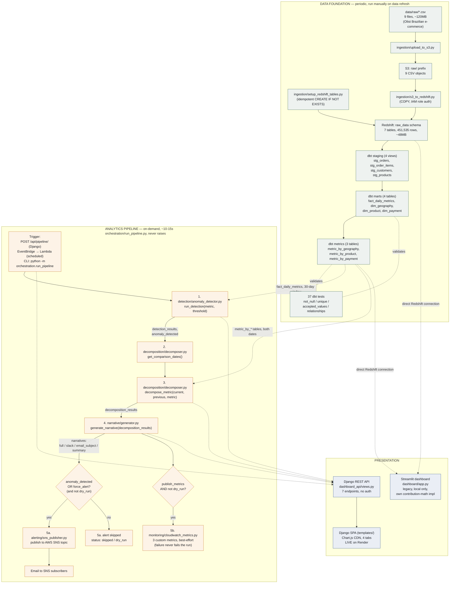
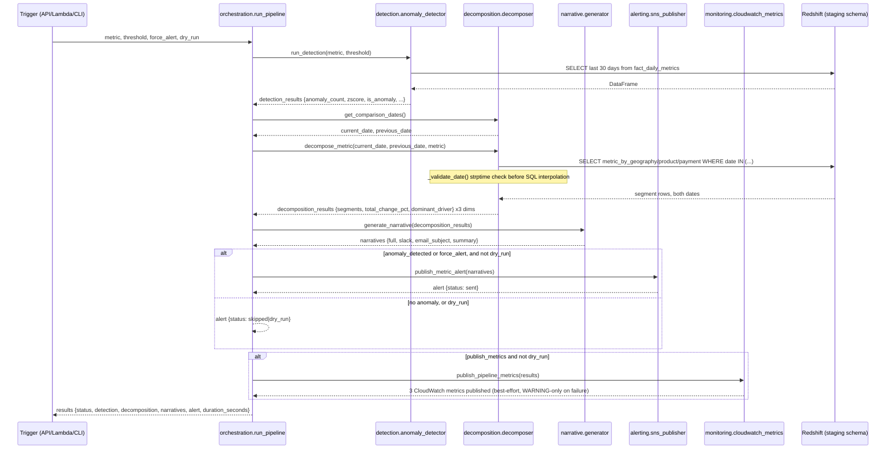

# MetricPulse — End-to-End Workflow

Visual + tabular reference for every step in the pipeline: what triggers it, what goes in, what
happens, what comes out, and what it hands to the next step. Complements
[`architecture.md`](architecture.md) (component-level system diagram) with the *data flow* view —
every arrow below is a concrete input/output, not just "layer A talks to layer B".

Scope: this reflects **Phase 0**, the live, verifiable system (`docs/ROADMAP.md`). The
LangGraph investigation agent (Phase 1+) is designed in `docs/scoping.md` but not yet built —
see the callout at the bottom.

---

## 1. System overview



---

## 2. One analytics-pipeline run, as a sequence

Shows exactly what data crosses each boundary during a single `run_pipeline()` call (the same
5-step sequence whether triggered by the Django button, the Lambda schedule, or the CLI).



---

## 3. Deployment & CI/CD

```mermaid
flowchart LR
    DEV["git push"] --> CI["GitHub Actions CI\nlint (flake8 E9/F63/F7/F82)\n+ pytest (15 tests)\n+ dbt parse — parallel"]
    CI -->|push to main, CI green| CD["GitHub Actions CD\nrequires production\nenvironment approval"]
    CD --> RENDER["Render\nGunicorn + WhiteNoise\nsettings_prod, live web app"]

    LAMBDA_SRC["Dockerfile + lambda_handler.py"] -.manual: deploy/deploy_lambda.sh.-> ECR["AWS ECR"]
    ECR -.-> LAMBDA["AWS Lambda"]
    EVB["EventBridge schedule"] -.manual: deploy/setup_schedule.sh.-> LAMBDA
    LAMBDA -->|scheduled invocation| RUNPIPE["orchestration.run_pipeline()"]

    style CD fill:#fdf3e7,stroke:#c97a2b
    style LAMBDA fill:#fdf3e7,stroke:#c97a2b
```

**Not wired together:** the CD pipeline only deploys the Django app to Render — it does not
build/push the Lambda image or run `dbt run`. Lambda deploys and dbt transforms on data refresh
are both manual today (`docs/ROADMAP.md` Phase 0 named gaps).

---

## 4. Step-by-step reference (inputs / process / outputs)

### 4.1 Data Foundation — periodic, run manually on data refresh

| # | Step | Module | Trigger | Input | Process | Output |
|---|------|--------|---------|-------|---------|--------|
| 1 | Upload to S3 | `ingestion/upload_to_s3.py` | Manual CLI | `data/raw/*.csv` (9 files, ~120MB) | Walks directory, uploads each file | S3 `raw/` prefix, 9 objects |
| 2 | Create Redshift tables | `ingestion/setup_redshift_tables.py` | Manual CLI | — (DDL only) | `CREATE SCHEMA raw_data`, `CREATE TABLE IF NOT EXISTS` × 7 | Empty typed tables in `raw_data` |
| 3 | Load into Redshift | `ingestion/s3_to_redshift.py` | Manual CLI | S3 `raw/*.csv` | `COPY` per table, IAM role auth, `IGNOREHEADER 1`, `DATEFORMAT/TIMEFORMAT auto` | `raw_data.*` populated, 451,535 rows (~48MB) |
| 4 | dbt staging | `dbt_project/models/staging/*.sql` | `dbt run --select staging` | `raw_data.*` | Rename/cast/filter, no joins (views) | 4 views: `stg_orders`, `stg_order_items`, `stg_customers`, `stg_products` |
| 5 | dbt marts | `dbt_project/models/marts/*.sql` | `dbt run --select marts` | staging views | Fact table + 3 dimension lookups (tables) | `fact_daily_metrics` (~760 rows), `dim_geography` (27), `dim_product` (~73), `dim_payment` (4) |
| 6 | dbt metrics | `dbt_project/models/metrics/*.sql` | `dbt run --select metrics` | staging views + marts | Pre-aggregate revenue/order-count per dimension per day | `metric_by_geography`, `metric_by_product`, `metric_by_payment` |
| 7 | dbt test | `dbt_project/models/**/schema.yml` | `dbt test` | all models above | `not_null`(18) / `unique`(9) / `accepted_values`(7) / `relationships`(3) | 37/37 pass/fail |

### 4.2 Analytics Pipeline — on-demand, ~10–15s end-to-end

| # | Step | Module | Input | Process | Output | Passed to next step |
|---|------|--------|-------|---------|--------|---------------------|
| 1 | Detect | `detection/anomaly_detector.py::run_detection()` | `metric` (default `total_revenue`), `threshold` (default 2.0 / env `ANOMALY_THRESHOLD_ZSCORE`), lookback 30 days (env `LOOKBACK_DAYS`) | Fetch 30-day window from `fact_daily_metrics` → z-score (`ddof=1`) → flag `|z| > threshold` | `detection_results` {anomaly_count, latest date/value/zscore, is_anomaly} | `anomaly_detected` boolean gates step 5 |
| 2 | Pick dates | `decomposition/decomposer.py::get_comparison_dates()` | — | Query latest two available dates | `current_date`, `previous_date` | Feeds step 3 |
| 3 | Decompose | `decomposition/decomposer.py::decompose_metric()` | `current_date`, `previous_date`, `metric` | `_validate_date()` guard → query `metric_by_geography/product/payment` for both dates → `contribution_pct = (segment_change / total_change) * 100` per segment → pick `dominant_driver` | `decomposition_results` per dimension: `segments[]`, `total_change`, `total_change_pct`, `dominant_driver` | Runs unconditionally (even with no anomaly) |
| 4 | Narrate | `narrative/generator.py::generate_narrative()` | `decomposition_results` | Render via 4 Jinja2 templates | `narratives` {`full`, `slack`, `email_subject`, `summary`} | Runs unconditionally |
| 5a | Alert (conditional) | `alerting/sns_publisher.py::publish_metric_alert()` | `narratives` | Publish to SNS topic (`SNS_TOPIC_ARN`) — **only if** `anomaly_detected or force_alert`, **and** `not dry_run` | `alert` {status: `sent`/`dry_run`/`skipped`/`error`} | Email to N subscribers |
| 5b | Ops metrics (conditional, best-effort) | `monitoring/cloudwatch_metrics.py::publish_pipeline_metrics()` | full `results` dict | 3× `put_metric_data`, namespace `MetricPulse` — **only if** `publish_metrics=True` and `not dry_run`; failure only logs WARNING | `PipelineExecutionSuccess` (1/0), `AnomaliesDetected` (count), `AlertsSent` (1/0) | CloudWatch dashboard |

Orchestrated by `orchestration/run_pipeline.py::run_pipeline()` — all 5 steps in one `try/except`
that never raises; on failure, `results['status'] = 'failed'` with whatever partial results were
already collected.

### 4.3 Presentation

| Component | File(s) | Reads from | Serves |
|-----------|---------|-----------|--------|
| Django REST API | `dashboard_api/views.py` (7 `APIView`s, no serializers) | Calls `detection`/`decomposition`/`narrative`/`orchestration` functions directly (in-process import, not HTTP) | `/api/health/`, `/api/metrics/`, `/api/anomalies/`, `/api/decomposition/`, `/api/narrative/`, `POST /api/pipeline/`, `POST /api/contact/` |
| Django SPA | `templates/` (Chart.js via CDN) | Client-side `fetch()` to the API above | 4 tabs (Home/Dashboard/Architecture/About): KPI cards, 60-day trend chart with anomalies highlighted, 3-panel contribution bars, narrative markdown, "Run Analysis" / "Run & Send Alert" buttons, threshold slider — **live on Render** |
| Streamlit dashboard (legacy) | `dashboard/app.py` | Direct Redshift connection (`@st.cache_resource`), bypasses the Django API entirely, **reimplements its own contribution math** rather than calling `decomposition.decomposer` | Local only (`streamlit run dashboard/app.py`), not deployed |

---

## 5. Planned, not yet built

`docs/ROADMAP.md` Phase 1 (all checkboxes unchecked as of this writing) designs a LangGraph
investigation agent that would sit between decomposition and narrative — grounding an LLM
synthesis step against `decomposition_results`/`drill_down_results` with citation validation,
exposed via `/api/investigate/`. It is scoped in `docs/scoping.md` §§2–4 but does not exist in
the running system — omitted from the diagrams above because they represent what's actually
live and testable today, not the design record.

---

## 6. Prompt for another LLM / image generator

Paste the block below into an image-generating LLM (or hand it to any diagramming tool) if you
want a polished illustration instead of — or alongside — the Mermaid diagrams above. It's
self-contained: no need to paste the rest of this file.

```
Create a clean, technical system-architecture / data-flow diagram (landscape orientation,
labeled boxes and arrows, not a photo-realistic scene) for a data pipeline called MetricPulse.
Use three visually distinct horizontal bands, top to bottom, each with its own subtle background
tint but consistent line style and typography throughout:

BAND 1 — "DATA FOUNDATION" (tint: muted sage/green), periodic batch process, left to right:
  [Raw CSV files, 9 files ~120MB] --arrow--> [S3 upload script] --arrow--> [S3 bucket, raw/ prefix]
  [S3 bucket] --arrow--> [COPY into Redshift] --arrow--> [Redshift raw_data schema, 7 tables, 451K rows]
  [Redshift raw_data] --arrow--> [dbt staging: 4 views] --arrow--> [dbt marts: fact_daily_metrics +
    3 dimension tables] --arrow--> [dbt metrics: 3 pre-aggregated tables by geography/product/payment]
  Small annotation near the dbt boxes: "37 automated tests validate this layer"

BAND 2 — "ANALYTICS PIPELINE" (tint: warm amber/orange), on-demand process that runs in ~10-15
  seconds, triggered by three possible sources shown converging into one entry point:
  [Django API button] , [Scheduled Lambda] , [CLI command] --> all arrow into--> [Orchestrator]
  Orchestrator fans out into a strict left-to-right sequence of 5 stages, each a labeled box,
  connected by arrows annotated with the data object passed between them:
  [1. Anomaly Detection (z-score)] --"detection results"--> [2. Segment Decomposition
    (geography / product / payment)] --"decomposition results"--> [3. Narrative Generation
    (plain-English text, 4 formats)] --"narrative text"--> [4. Decision diamond: anomaly detected
    OR forced?] --yes--> [5a. SNS Alert --> email icon] ; --no--> [skipped, dashed line]
  A secondary thin arrow from stage 3 down to a small side box [Ops metrics --> CloudWatch icon].

BAND 3 — "PRESENTATION" (tint: muted blue), receiving arrows up from Band 2's stages 1-3:
  [Django REST API, 7 endpoints] --arrow--> [Web dashboard (SPA), charts + narrative + trigger
    button, labeled "live in production"]
  A separate, visually de-emphasized/greyed box [Legacy local dashboard] connected directly to
  the Redshift icon in Band 1 with a dashed line (bypasses the API), labeled "local only, not
  deployed".

Style: modern technical diagram, rounded rectangle nodes, thin consistent arrow weight, a small
distinct icon per box (database cylinder for Redshift/S3, envelope for email, browser window for
the dashboard, gear for scripts), generous whitespace, a legible sans-serif label on every node
and every arrow, a small legend explaining the three band colors. No decorative background, no
photorealism, no gradients beyond the subtle band tints. Aspect ratio roughly 16:9.
```
